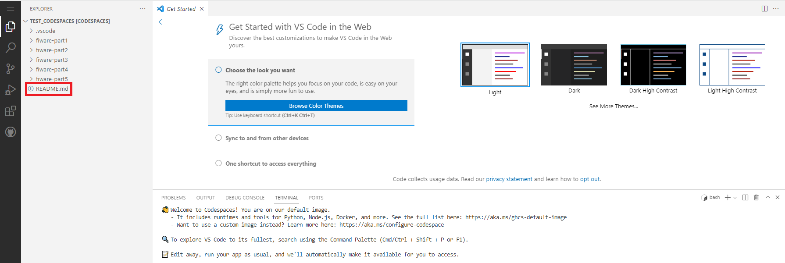

# FIWARE学習コンテンツ

このコンテンツの概要説明

## 始めに
GitHub codespacesを起動後、README.mdをクリックして手順を確認してください。

## PART1

FIWAREの数あるコンポーネントの中でも重要な役割を担っている[FIWARE Orion](https://fiware-orion.readthedocs.io/en/master/)の起動方法を学習します。

[PART1へ](fiware-part1/README.md)

## PART2

FIWARE Orionのデータ操作における基本的な操作を学習していきます。

[PART2へ](fiware-part2/README.md)

## PART3

FIWARE OrionのSubscription機能について学習していきます。

[PART3へ](fiware-part3/README.md)

## PART4

FIWARE Cygnusによる履歴データの作成について学習していきます。

[PART4へ](fiware-part4/README.md)

## PART5

Fiware-ServiceとFiware-ServicePathについて学習していきます。

[PART5へ](fiware-part5/README.md)

## PART6

FIWARE OrionのRegistration機能について学習していきます。

[PART6へ](fiware-part6/README.md)

## PART7

FIWARE Orionのログ設定について学習していきます。

[PART7へ](fiware-part7/README.md)

## PART9

FIWAREコンポーネントのアクセス保護について学習していきます。

[PART9へ](fiware-part9/README.md)
