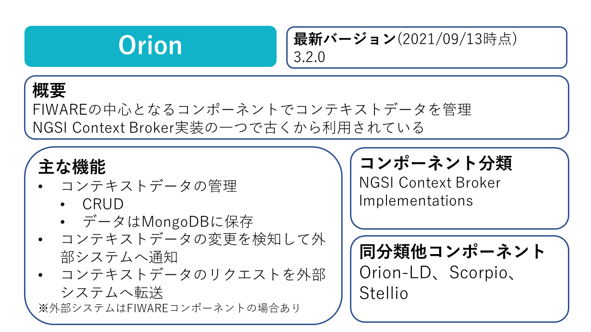
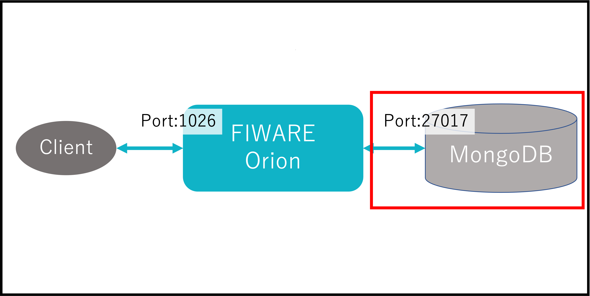
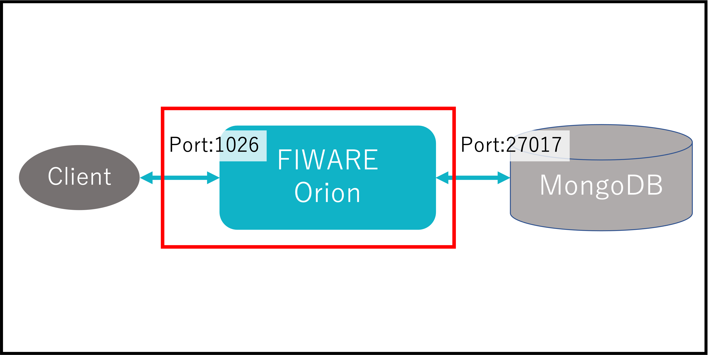

Part1ではFIWARE Orionを起動するために必要な知識を習得します。

# Orionの概要

このパートでは以下の構成を目指します。

# 1-1 MongoDBの起動

まずはOrionのデータベースとして使われるMongoDBの立ち上げを行いましょう。

MongoDBの起動には[Docker](https://www.docker.com/)を使います。  
※今回はFIWAREの学習がメインなので[Docker](https://www.docker.com/)の説明については割愛します。

1. 以下のコマンドでMongoDBを起動します。

   `docker run --name mongodb -d mongo:4.4`

2. 完了したら以下のコマンドで起動しているコンテナを確認します。

   `docker ps`

   一覧に`mongodb`があれば成功です。

# 1-2 Orionの起動

次にOrion本体を起動します。

MongoDBと同様にDockerHubに公開されているFIWARE公式のImageを使って起動することができます。

1. 以下のコマンドでOrionを起動します。

   `docker run -d --name orion --link mongodb:mongodb -p 1026:1026 fiware/orion -dbhost mongodb`

2. 完了したら以下のコマンドで起動しているコンテナを確認します。

   `docker ps`

   一覧に`orion`と`mongodb`があれば成功です。

[STEP2へ](step2.md)