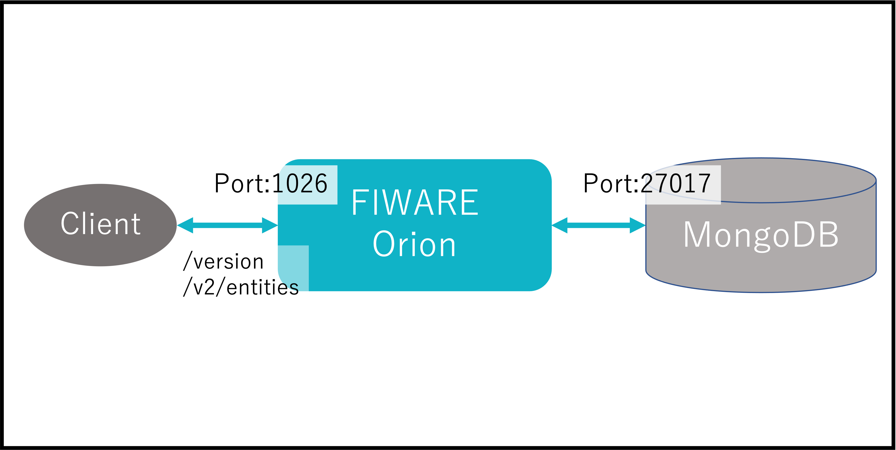

[STEP1へ](step1.md)

先ほど起動したFIWARE Orionにアクセスします。
Orionのデフォルトポートは`1026`で起動します。今回はコンテナの外からも同じように`1026`でアクセスできるようにポートフォワーディングしています。

問題なく動作していることを確認するため、`/version`と`/v2/entities`にアクセスしてみましょう。

# 2-1 Orionのバージョン情報を取得

`curl localhost:1026/version`

json形式でOrionのバージョン情報が取得できれば成功です。

# 2-2 OrionのEntity一覧を取得

`curl localhost:1026/v2/entities`

まだデータは入っていないので空のjson配列`[]`が返ってくれば成功です。

# 2-3 コンテナの停止・削除
起動したコンテナを停止・削除します。

1. 以下コマンドでコンテナを停止・削除します。

   `docker stop $(docker ps -q)`

   `docker rm $(docker ps -q -a)`

2. 完了したら以下のコマンドでコンテナが停止・削除されていることを確認します。

   `docker ps -a`

   一覧に何も表示されていなければ成功です。

[終了](finish.md)
