Part10ではFIWARE Wirecloudを利用したデータの可視化について学習していきます。

# 1-1 FIWARE Wirecloudの機能


# 1-2 構成の起動

今回は以下の構成を起動します。


以下のコマンドを実行します。

```
docker-compose -f fiware-part10/assets/docker-compose.yml up -d
```

ターミナルの処理が終了したら以下のコマンドで起動していることを確認します。

```
docker ps
```

一覧に**fiware-orion**, **postgres-db**, **mongo-db**, **fiware-wirecloud**, **ngsi-proxy**, **elasticsearch**, **memcached**, **nginx**があれば成功です。

# 1-3 FIWARE Orionへのデータ投入

以下のコマンドを実行し、Orionにデータを登録します。

```
curl -X POST localhost:1026/v2/entities -s -S -H 'Content-Type: application/json' -d @- <<EOF
{
  "id": "NuisanceWildlife1",
  "type": "NuisanceWildlife",
  "animalCategory": {
    "value": "beasts"
  },
  "animalName": {
    "value": "bear"
  },
  "location": {
    "value": "37.69, 140.9",
    "type": "geo:point"
  },
  "time": {
    "value": "2021-03-09T08:32:00+09:00"
  }
}
EOF
```

今回登録するEntityは野生動物による獣害(NuisanceWildlife)の情報で、動物名(animalName)、出没した場所(location)などのattributeがあります。

以下のコマンドを実行し、登録したデータを確認します。

```
curl localhost:1026/v2/entities | jq
```

# 1-4 WireCloudでの設定

以下のコマンドを実行し、WireCloud用のスーパーユーザを作成します。

```
docker-compose -f fiware-part10/assets/docker-compose.yml exec wirecloud python manage.py createsuperuser
```

スーパーユーザの情報を対話形式で入力します。

```
Username (leave blank to use 'root'): ユーザ名
Email address: メールアドレス
Password: パスワード
Password (again): パスワード再入力
Superuser created successfully.
```

WireCloudを使って可視化用Web画面を構築していきます。ログイン画面にアクセスしてスーパーユーザでログインをします。(ユーザ名とパスワードは先ほどのスーパーユーザの作成で設定した値)

以下の手順でログイン画面にアクセスします。

1. **ポートタブ**をクリックします。


2. **ポート80**の行にカーソルを合わせると表示される、赤枠のアイコンをクリックします。


3. 画面右上の**サインイン**をクリックします。


4. ログイン画面が表示されます。


**ハンバーガーメニュー**から **＋ 新しいワークスペース**をクリックします。

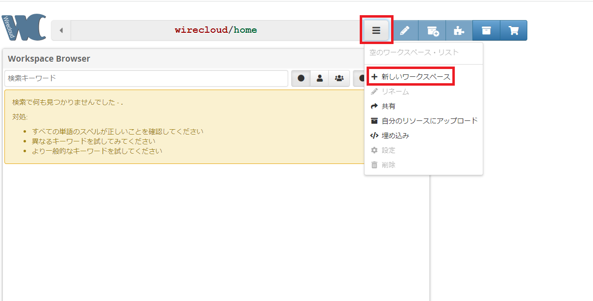

**名前**にワークスペース名を入力し、**設定ボタン**をクリックします。

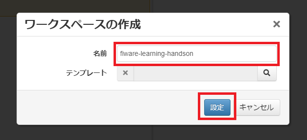

### ウィジェットの追加

次にウィジェットを追加します。
ウィジェットはWireCloudにおいて画面を構成するために必要なコンポーネントとなっており、外部からダウンロードしたウィジェットをWireCloudへアップロードすることで使うことができます。
今回は以下のウィジェットを使用します。 以下のリンクからすべてのウィジェットをダウンロードします。

- [ol3-map-widget](https://github.com/Wirecloud/ol3-map-widget) ([ダウンロード](https://github.com/Wirecloud/ol3-map-widget/releases/download/1.2.3/CoNWeT_ol3-map_1.2.3.wgt))
- [ngsi-source-operator](https://github.com/wirecloud-fiware/ngsi-source-operator) ([ダウンロード](https://github.com/wirecloud-fiware/ngsi-source-operator/releases/download/4.2.0/CoNWeT_ngsi-source_4.2.0.wgt))
- [ngsi-entity2poi-operator](https://github.com/wirecloud-fiware/ngsi-entity2poi-operator) ([ダウンロード](https://github.com/wirecloud-fiware/ngsi-entity2poi-operator/releases/download/v3.2.2/CoNWeT_ngsientity2poi_3.2.2.wgt))


**マイ・リソースボタン**をクリックします。

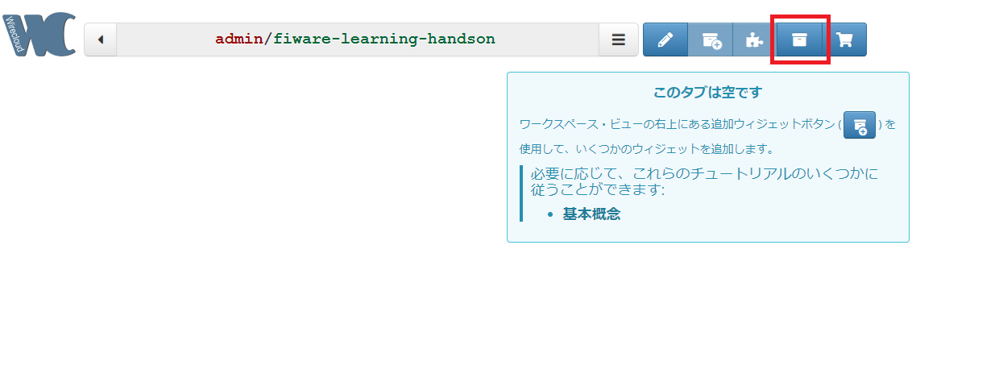

次に**アップロードボタン**をクリックします。

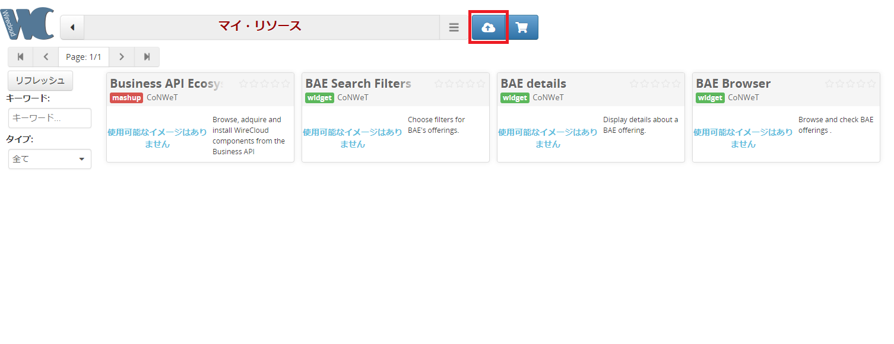

ダウンロードしたウィジェットを画面にドラッグ&ドロップすることで追加できます。ファイルの追加ができたら**アップロードボタン**をクリックします。

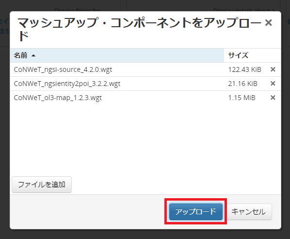

画面上部の**戻るボタン**をクリックし、ワークスペース画面に戻ります。

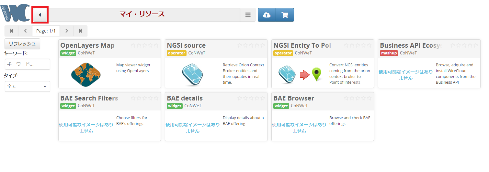

### ワイヤーリングで画面を作成

**編集ボタン**をクリックすると、ワイヤーリングなど画面の編集ができるようになります。

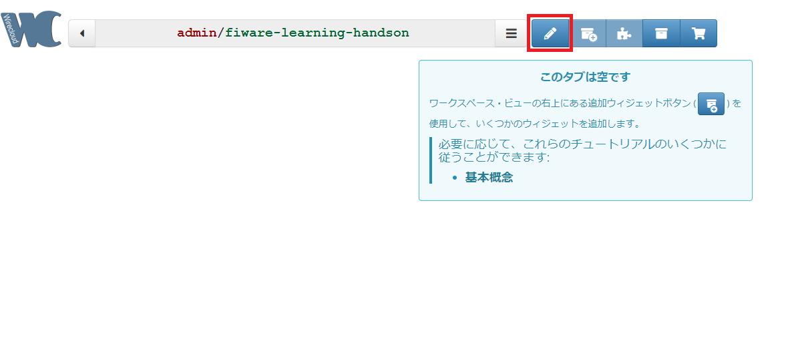

次に**ワイヤーリングボタン**をクリックします。

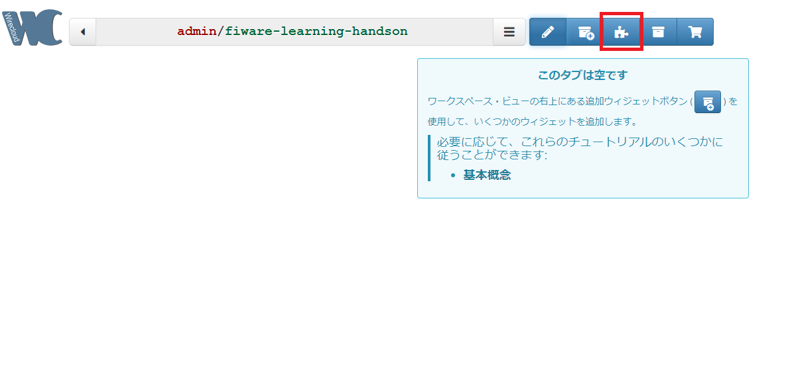

次に**コンポーネントの検索ボタン**をクリックします。

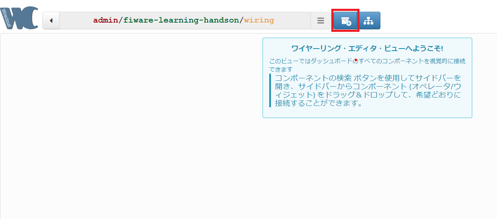

OpenLayers Mapの **+ボタン**をクリックすると、下にオレンジのボックスが作成されます。そのボックスを右側の空白にドラッグ&ドロップします。

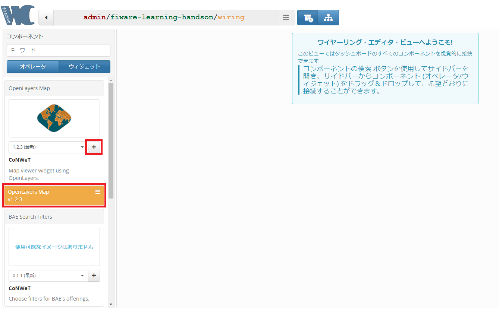

青色のタブから**オペレーター**に切り替えます。

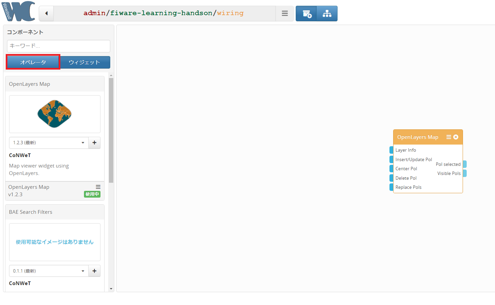

NGSI SourceとNGSI Entity To PoIも同じように **+ボタン**をクリックし、作成された緑色の箱を右側の空白にドラッグ&ドロップします。

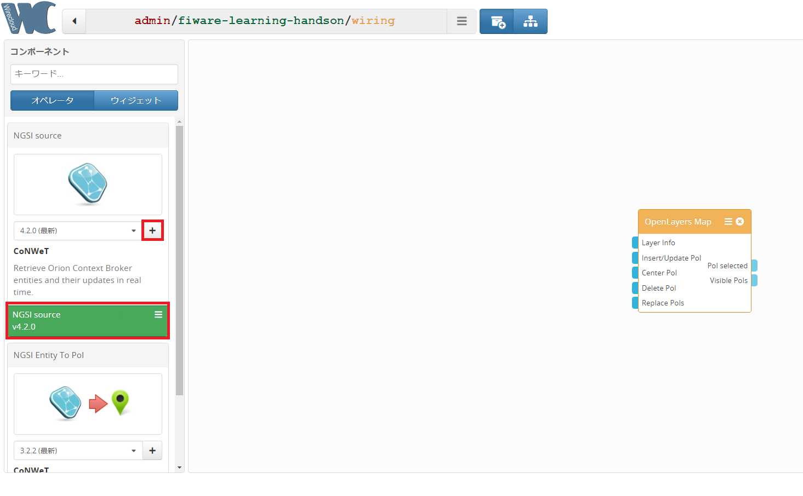

以下のようにウィジェットの接続を行います。
接続の方法は出っ張っている青色のコネクタを接続先のコネクタへドラッグ&ドロップします。

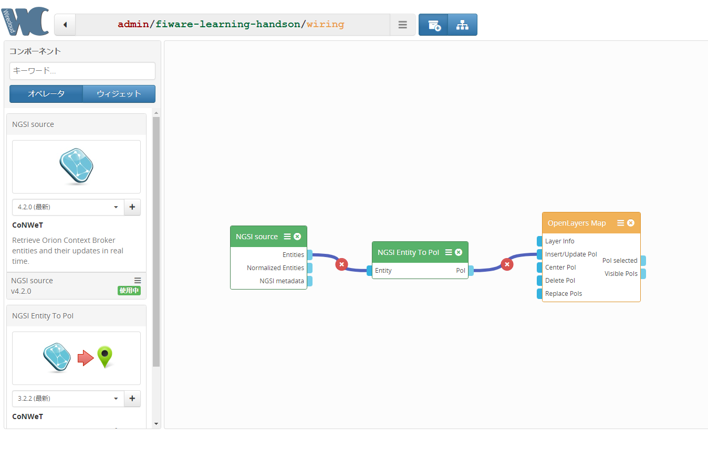

ここで一度Codespacesの画面に戻り、後述するデータのリアルタイム更新に必要な設定を行います。  
※この設定はNGSI Sourceの設定の前に行う必要があります

**ポートタブ**をクリックします。


**ポート8100**の行で右クリックし、表示されたメニューから**ポートの表示範囲**にカーソルを合わせ、さらに表示されたメニューから**public**を選択します。

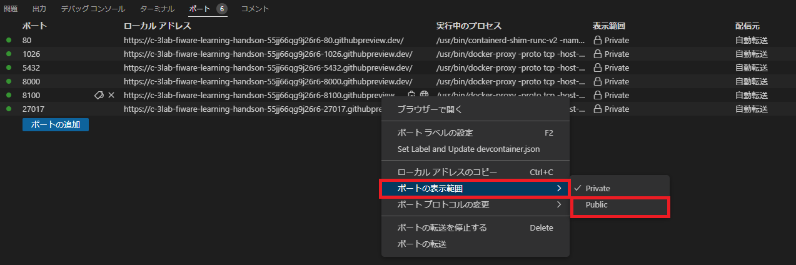

Wirecloudの画面に戻り、NGSI Sourceの**ハンバーガーメニュー**をクリックします。表示されたメニューから**設定**をクリックします。

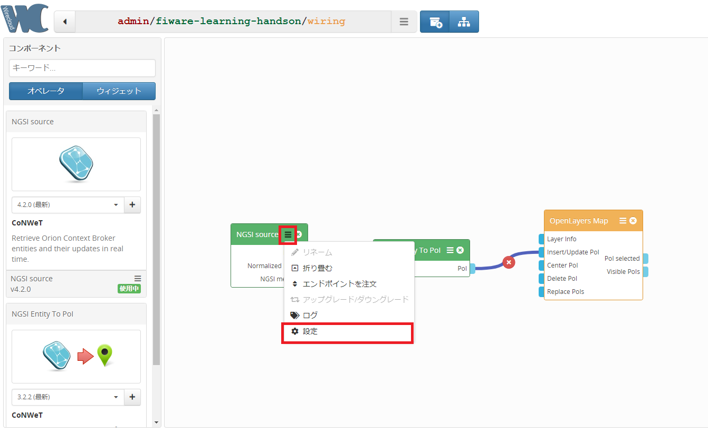

オペレータの設定を以下のように入力し**設定ボタン**をクリックします。

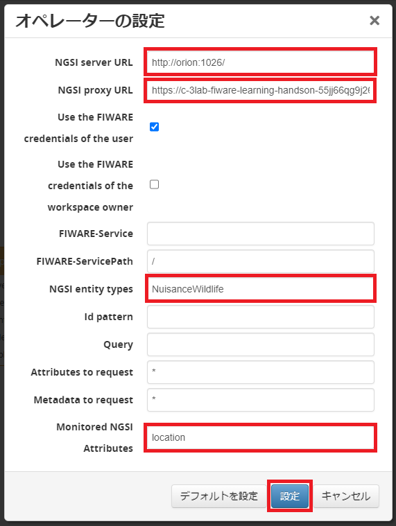

入力する値は以下をコピー&ペーストします。

NGSI server URL: `http://orion:1026/`  
NGSI proxy URL: ※1 ※2  
NGSI entity types: `NuisanceWildlife`  
Monitored NGSI Attributes: `location`

※1 **NGSI proxy URL**にはCodespacesの画面からコピーした値を設定します。**ポート8100**の行にカーソルを合わせると表示される、赤枠のアイコンをクリックし、値をコピーします。

※2 ローカル環境の場合、**NGSI Proxy URL**にはDockerネットワーク内のホスト名を指定します。但し、ブラウザからNGSI Proxyに対して通信を行う際に同じURLを利用するため、hostsファイルを編集するなどして、Dockerネットワーク内のホスト名で`127.0.0.1`に繋がるように設定する必要があります。(OS毎に手順は異なります)

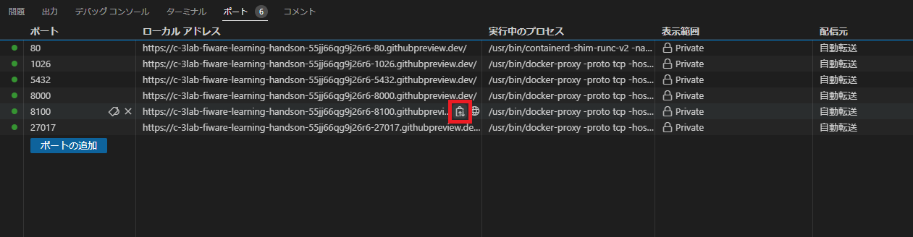

オペレータの設定の内、赤枠の項目の説明は以下の通りです。
|項目名|説明|
|-|-|
|NGSI server URL|エンティティ情報を取得するOrionのURLを設定します。|
|NGSI proxy URL|変更通知を受け取るために使用するプロキシのURLを設定します。|
|NGSI entity types|Orionから取得するエンティティをフィルタリングするために、エンティティのタイプをカンマ区切りで設定します。|
|Monitored NGSI Attributes|Orionの更新を検知するために監視する属性を設定します。この項目を設定することで、自動でOrionにサブスクリプションが作成されます。設定しなかった場合、サブスクリプションは作成されません。|

画面上部の**戻るボタン**をクリックし、ワークスペース画面に戻ります。

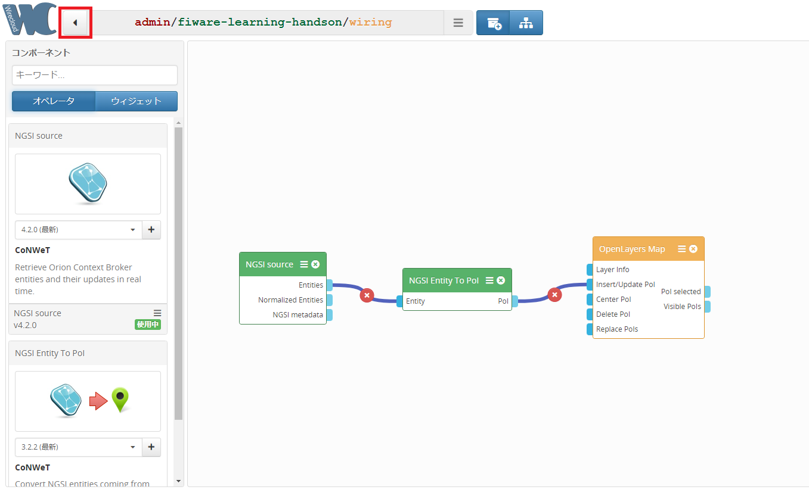

# 1-5 可視化の確認

サンプルデータとして登録した情報が地図上にピンとして表示されています。ピンを押すと吹き出しが表示され詳細情報を見ることもできます。

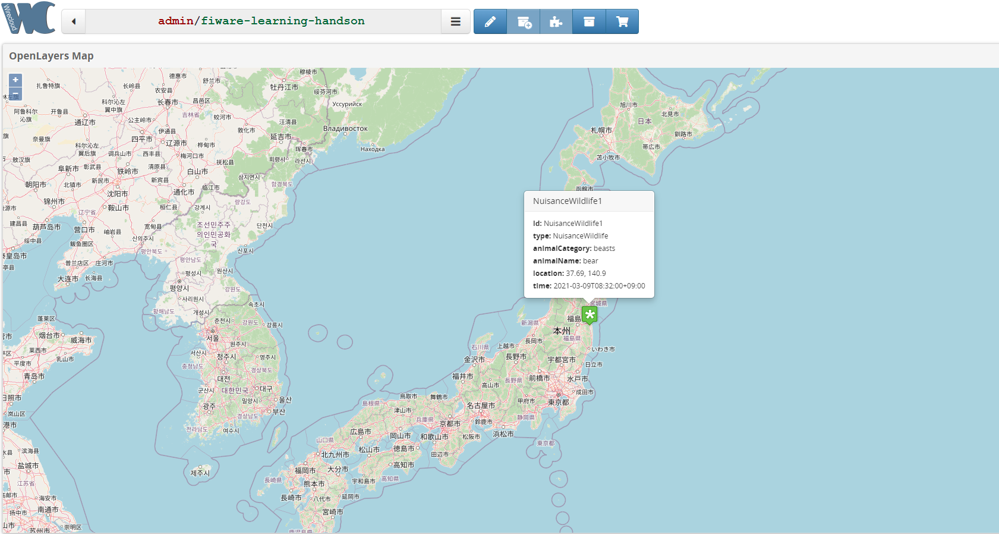

OrionのEntityを更新するとリアルタイムで更新が反映されます。

クマが移動したことを想定して、Entityのlocationの値を更新してみましょう。

以下のコマンドを実行し、locationを更新します。

```
curl localhost:1026/v2/entities/NuisanceWildlife1/attrs -s -S -H 'Content-Type: application/json' -X PATCH -d @- <<EOF
{
  "location": {
    "value": "37.99, 140.3",
    "type": "geo:point"
  }
}
EOF
```

以下のコマンドを実行し、locationが更新されていることを確認します。

```
curl localhost:1026/v2/entities | jq
```

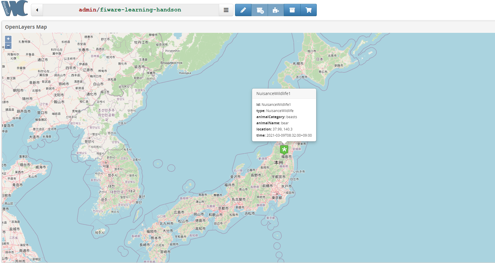

地図上のピンが移動していることを確認します。

# 1-6 その他の可視化方法の紹介

その他の可視化方法の例として Knowage を紹介します。

Knowageは、BIとデータ分析のためのFIWAREコンポーネントです。Orionが連携するデータやRDBMSなどを組み合わせて、データ分析を行います。分析結果は、ドラッグ&ドロップ操作でコンポーネントを組み合わせることで可視化できます。


- [公式サイト](https://www.knowage-suite.com/site/)
- [ドキュメント](https://knowage.readthedocs.io/en/latest/)

# 1-7 コンテナの停止・削除
起動したコンテナを停止・削除します。

1. 以下コマンドでコンテナを停止・削除します。

   `docker-compose -f fiware-part10/assets/docker-compose.yml down`

2. 完了したら以下のコマンドでコンテナが停止・削除されていることを確認します。

   `docker ps -a`

一覧に何も表示されていなければ成功です。

[終了](./finish.md)

