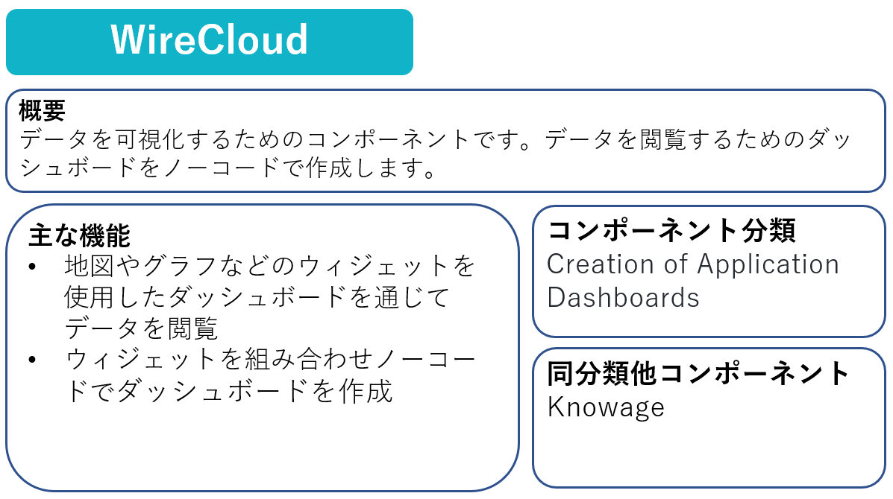
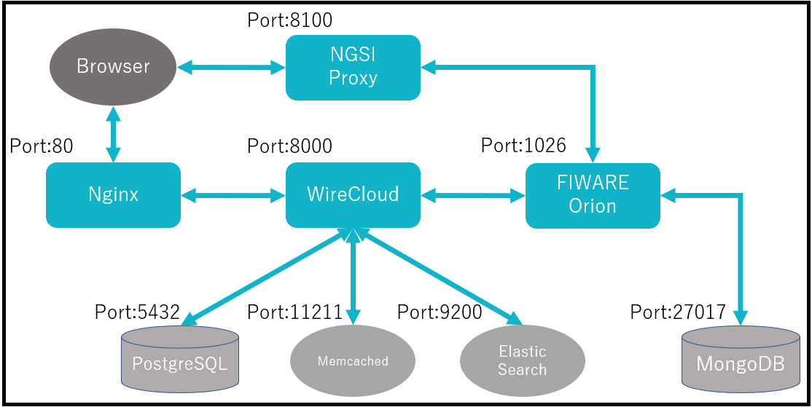
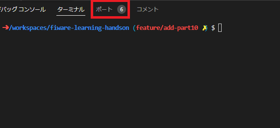
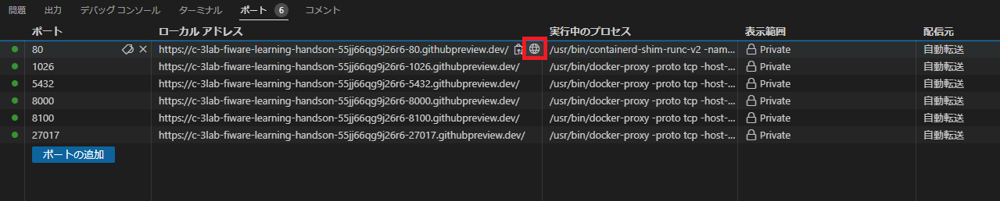
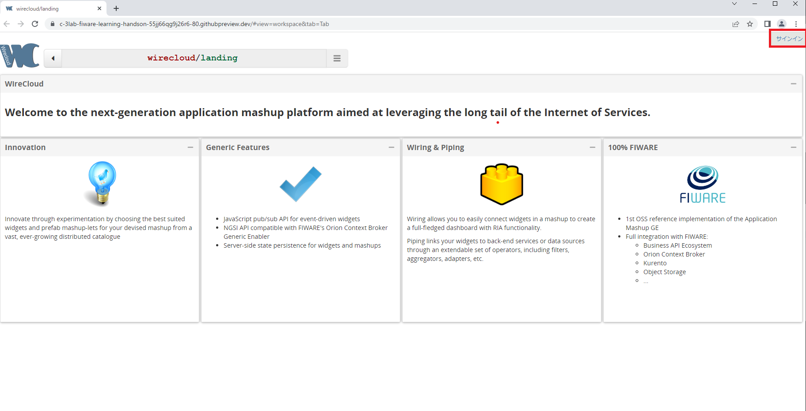
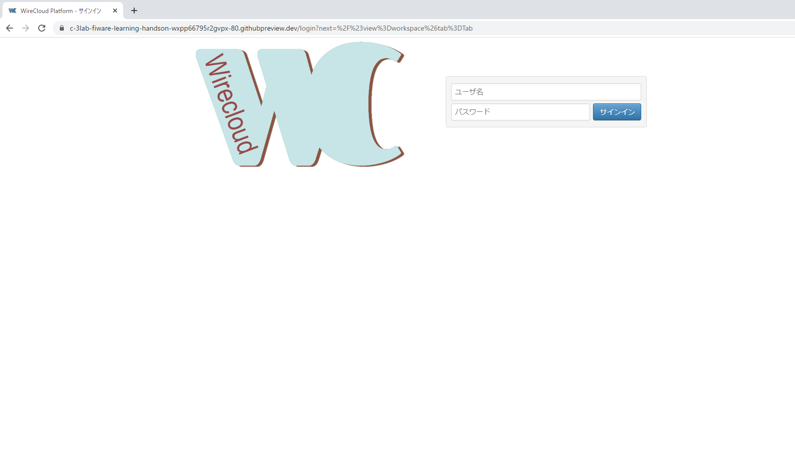

Part10ではFIWARE Wirecloudを利用したデータの可視化について学習していきます。

# 1-1 FIWARE Wirecloudの機能



# 1-2 構成の起動

今回は以下の構成を起動します。



以下のコマンドを実行します。

```
docker compose -f fiware-part10/assets/docker-compose.yml up -d
```

ターミナルの処理が終了したら以下のコマンドで起動していることを確認します。

```
docker compose -f fiware-part10/assets/docker-compose.yml ps
```

一覧に**fiware-orion**, **postgres-db**, **mongo-db**, **fiware-wirecloud**, **ngsi-proxy**, **elasticsearch**, **memcached**, **nginx**があれば成功です。

# 1-3 FIWARE Orionへのデータ投入

以下のコマンドを実行し、Orionにデータを登録します。

```
curl -X POST localhost:1026/v2/entities -s -S -H 'Content-Type: application/json' -d @- <<EOF
{
  "id": "NuisanceWildlife1",
  "type": "NuisanceWildlife",
  "animalCategory": {
    "value": "beasts"
  },
  "animalName": {
    "value": "bear"
  },
  "location": {
    "value": "37.69, 140.9",
    "type": "geo:point"
  },
  "time": {
    "value": "2021-03-09T08:32:00+09:00"
  }
}
EOF
```

今回登録するEntityは野生動物による獣害(NuisanceWildlife)の情報で、動物名(animalName)、出没した場所(location)などのattributeがあります。

以下のコマンドを実行し、登録したデータを確認します。

```
curl localhost:1026/v2/entities | jq
```

# 1-4 WireCloudの設定

以下のコマンドを実行し、WireCloud用のスーパーユーザを作成します。

```
docker compose -f fiware-part10/assets/docker-compose.yml exec wirecloud python manage.py createsuperuser
```

スーパーユーザの情報を対話形式で入力します。

```
Username (leave blank to use 'root'): ユーザ名
Email address: メールアドレス
Password: パスワード
Password (again): パスワード再入力
Superuser created successfully.
```

WireCloudを使って可視化用Web画面を構築していきます。ログイン画面にアクセスしてスーパーユーザでログインをします。(ユーザ名とパスワードは先ほどのスーパーユーザの作成で設定した値)

以下の手順でログイン画面にアクセスします。

1. **ポートタブ**をクリックします。



2. **ポート80**の行にカーソルを合わせると表示される、赤枠のアイコンをクリックします。



3. 画面右上の**サインイン**をクリックします。



4. ログイン画面が表示されます。



[STEP2へ](step2.md)
