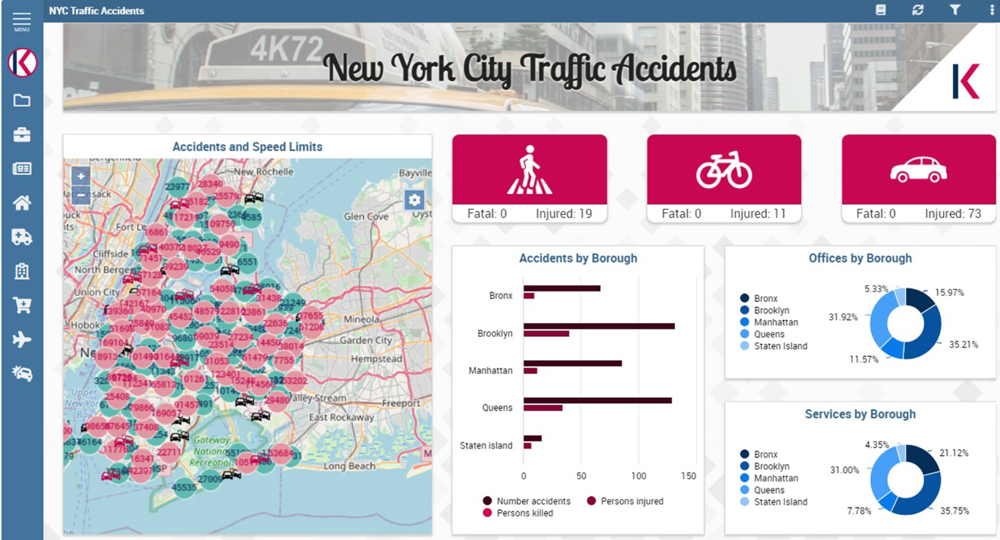

[STEP2へ](step2.md)

# 3-1 その他の可視化方法の紹介

その他の可視化方法の例として Knowage を紹介します。

Knowageは、BIとデータ分析のためのFIWAREコンポーネントです。Orionが連携するデータやRDBMSなどを組み合わせて、データ分析を行います。分析結果は、ドラッグ&ドロップ操作でコンポーネントを組み合わせることで可視化できます。

- [公式サイト](https://www.knowage-suite.com/site/)
- [ドキュメント](https://knowage.readthedocs.io/en/latest/)

# 3-2 コンテナの停止・削除
起動したコンテナを停止・削除します。

1. 以下コマンドでコンテナを停止・削除します。

   `docker compose -f fiware-part10/assets/docker-compose.yml down`

2. 完了したら以下のコマンドでコンテナが停止・削除されていることを確認します。

   `docker compose -f fiware-part10/assets/docker-compose.yml ps -a`

一覧に何も表示されていなければ成功です。

[終了](./finish.md)
