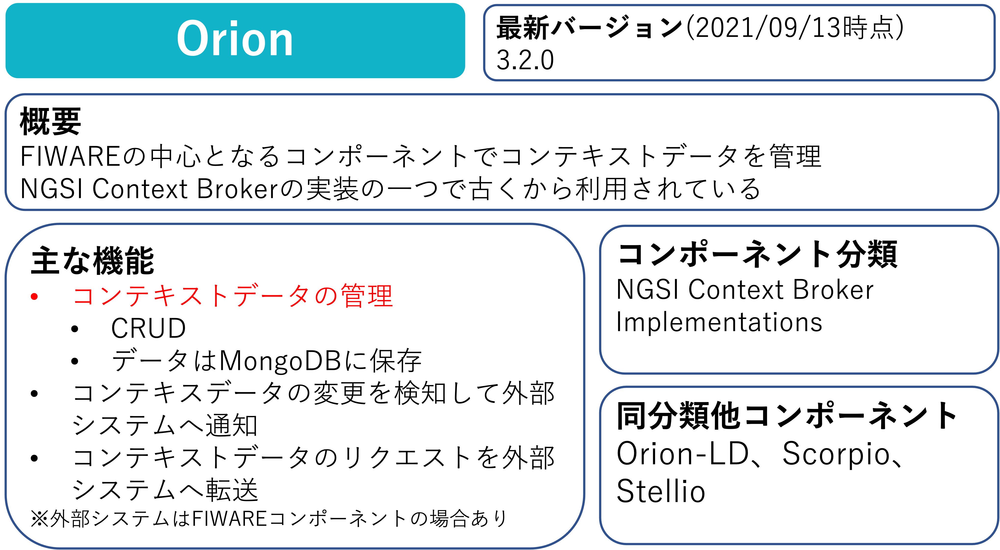

Part2ではFIWARE Orionのデータ操作における基本的な操作を学習していきます。

# Orionの概要

# 1-1 FIWARE OrionとMongoDBの起動

まずは以下の構成を作ります。

今回はdocker-composeを使い、FIWARE OrionとMongoDBの起動を同時に行います。  
※今回はFIWAREの学習がメインなので[docker-compose](https://docs.docker.jp/compose/toc.html)の説明については割愛します。

1. 以下のコマンドでFIWARE公式で公開されているdocker-compose.ymlをダウンロードします。

   `wget -P fiware-part2/assets https://github.com/telefonicaid/fiware-orion/raw/master/docker/docker-compose.yml`

2. ダウンロードしたdocker-compose.ymlの中身を確認します。

   `cat fiware-part2/assets/docker-compose.yml`

   **orion**と**mongodb**の起動に必要な記述が書かれていることを確認します。

3. ダウンロードしたdocker-compose.ymlを実行します。※ファイルを指定しない場合はデフォルトで**docker-compose.yml**が実行されます。

   `docker-compose -f fiware-part2/assets/docker-compose.yml up -d`

4. 実行が完了したら起動していることを確認します。

   `docker ps`

   一覧に**orion**と**mongodb**があれば成功です。

# 1-2 FIWARE Orionの動作確認

FIWARE Orionが問題なく動作していることを確認するために以下のコマンドを実行します。

`curl localhost:1026/v2/entities`

まだデータは入っていないので空のjson配列`[]`が返ってくれば成功です。

[STEP2へ](step2.md)