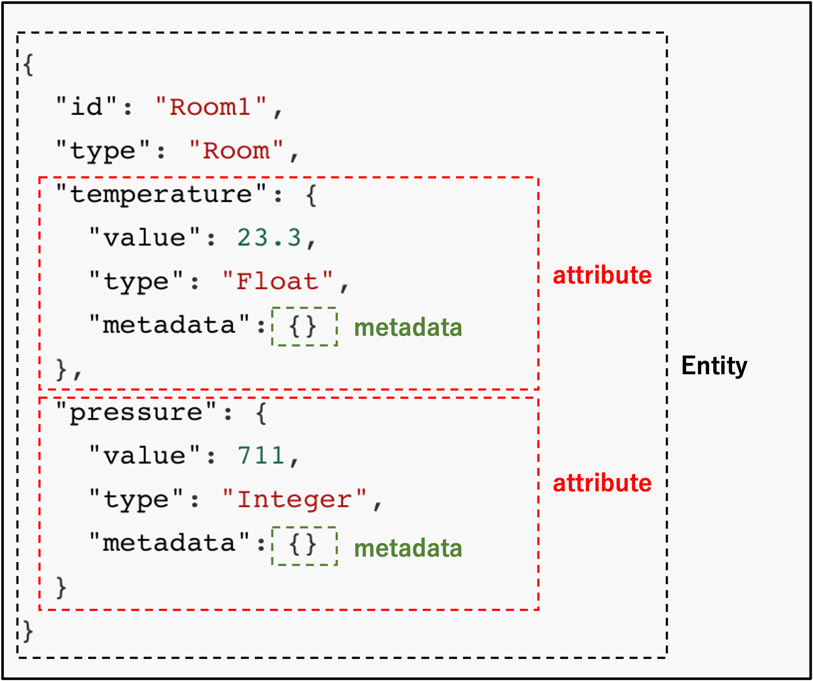
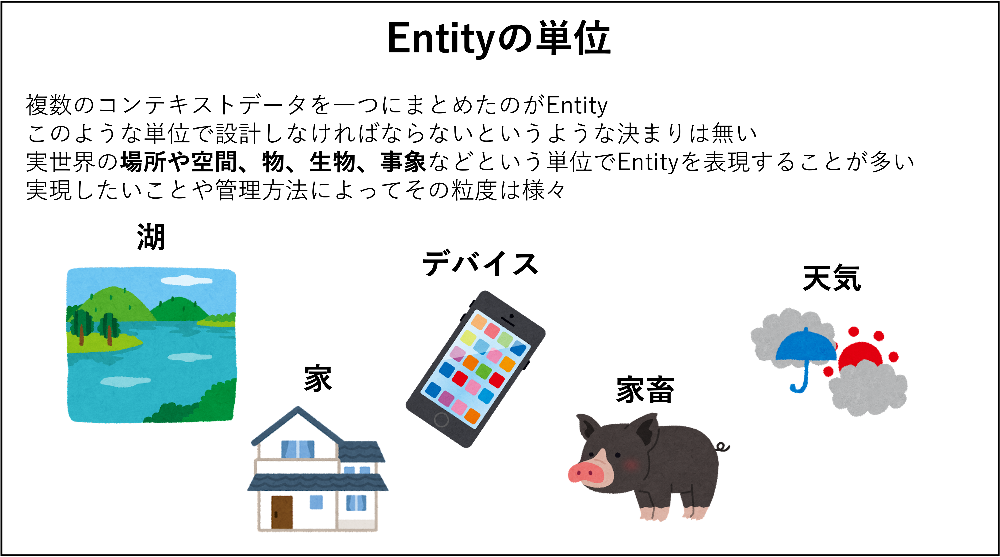

[STEP1へ](step1.md)

Orionのデータ操作を行うためにデータの形式を学びましょう。

# 2-1 NGSI v2 について

FIWARE OrionではNGSIという形式でデータの管理を行います。  
※今回はNGSI v2を使います。


NGSIv2は以下のようなデータモデルになります。


NGSIではjson形式でデータを表現します。  
実例のデータを見て見ましょう。

`cat fiware-part2/assets/example-ngsi-room1.json`


データモデル図の踏まえて、以下に実例として部屋(Room)の温度(temperature)と気圧(pressure)の情報を含んだEntityを示しています。



Orionではコンテキスト情報(例では温度、気圧など)を含めたデータの一括りをEntityと呼びます。



# 2-2 Entityの登録

以下のコマンドで先ほどのEntityをOrionに登録して見ましょう。  
Entityを登録する際はHTTPで **/v2/entities**というエンドポイントに対してPOSTをおこないます。

1. Room1を登録します。

   `curl localhost:1026/v2/entities -s -S -H 'Content-Type: application/json' -X POST -d @fiware-part2/assets/example-ngsi-room1.json`

2. 先ほど投入したEntityを確認します。

   `curl localhost:1026/v2/entities | jq`


# 2-3 Entity attributeを更新

Entityのidやtypeを変更する必要がない場合はattributeのみの更新を行えます。  
**/v2/entities/{id}/attrs**に対してPOSTを行うことで複数のattributeを更新できます。

1. Room1のattributeを更新します。
   ```
   curl localhost:1026/v2/entities/Room1/attrs -s -S -H 'Content-Type: application/json' -X PATCH -d @- <<EOF
   {
     "temperature": {
       "value": 26.5,
       "type": "Float"
     },
     "pressure": {
       "value": 763,
       "type": "Integer"
     }
   }
   EOF
   ```

2. Entityが更新されていることを確認します。

   `curl localhost:1026/v2/entities | jq`

# 2-4 attributeのvalueのみの更新

**/v2/entities/{id}/attrs/{attrName}/value**に対してPUTを行うことで値のみを指定して更新できます。  
ここではContent-typeがtext/plainとなる点を注意します。


1. Room1のvalueを更新します。

   `curl localhost:1026/v2/entities/Room1/attrs/temperature/value -s -S -H 'Content-Type: text/plain' -X PUT -d 28.5`

2. Entityが更新されていることを確認します。

   `curl localhost:1026/v2/entities | jq`


# 2-5 Entityの追加

現在登録されているEntity idとは異なるidを **/v2/entities**に対してPOSTした場合は別のEntityとして登録されます。


以下のコマンドで追加するRoom2のEntityを確認します。

`cat fiware-part2/assets/example-ngsi-room2.json`

```json
{
  "id": "Room2",
  "type": "Room",
  "temperature": {
     "value": 19.9,
     "type": "Float",
     "metadata": {}
  },
  "pressure": {
     "value": 719,
     "type": "Integer",
     "metadata": {}
  }
}
```

1. Room2を登録します。

   `curl localhost:1026/v2/entities -s -S -H 'Content-Type: application/json' -X POST -d @fiware-part2/assets/example-ngsi-room2.json`

2. Room2 Entityが追加されていることを確認します。

   `curl localhost:1026/v2/entities | jq`

   Room1とRoom2のEntityが表示されれば成功です。

[STEP3へ](step3.md)