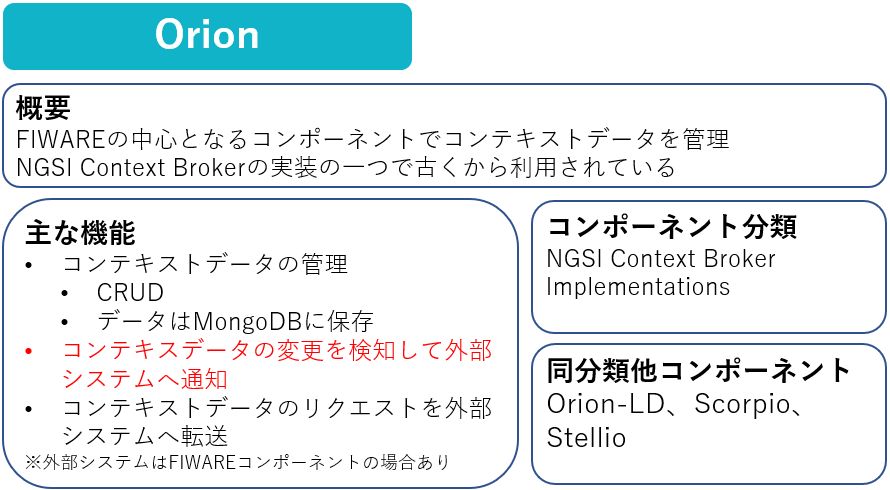
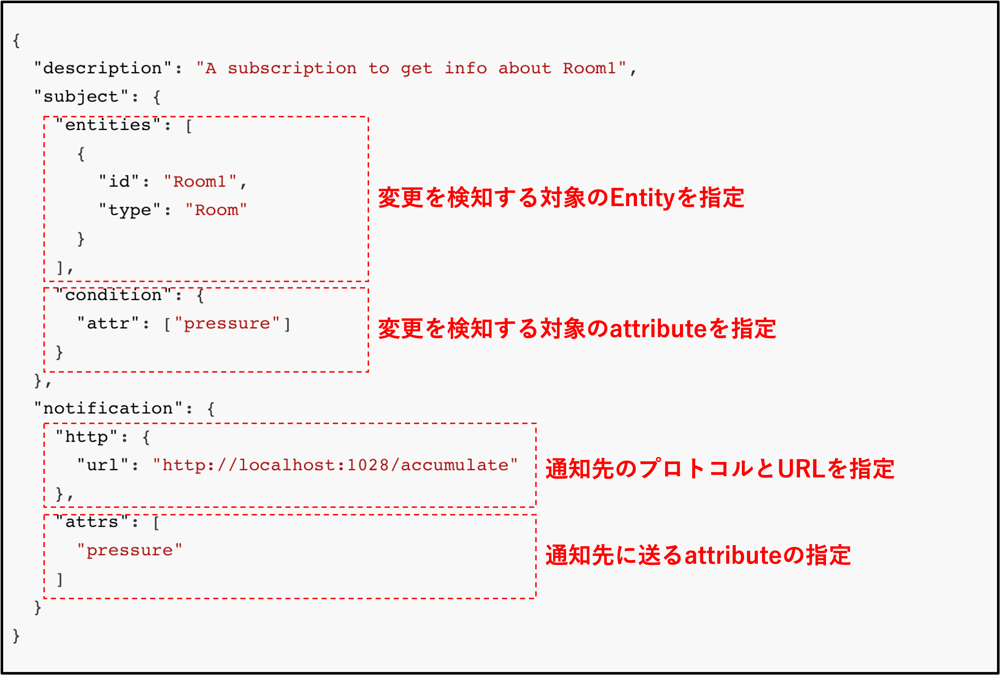

Part3ではFIWARE OrionのSubscription機能について学習していきます。

# Orionの概要

# 1-1 構成の起動

今回は以下の構成を起動します。  
※起動の詳細に関してはの[Part1](../fiware-part1/step1.md)または[Part2](../fiware-part2/step1.md)を参照

以下のコマンドを実行します。

`./fiware-part3/setup.sh `

ターミナルの処理が終了したら以下のコマンドで動作確認します。

`curl localhost:1026/v2/entities | jq`

# 1-2 FIWARE OrionのSubscription機能について

FIWARE Orionにはデータの変更を検知して特定のシステムへ通知する機能があります。
`/v2/subscriptions/`へPOSTすることで通知の設定ができます。

POSTする際のbodyは以下の通りです。

この例では**Room1**の**pressureの値**が更新されたら、通知先のURLへ**pressureのattribute**をHTTPのPOSTで送信するような設定です。

[STEP2へ](step2.md)
