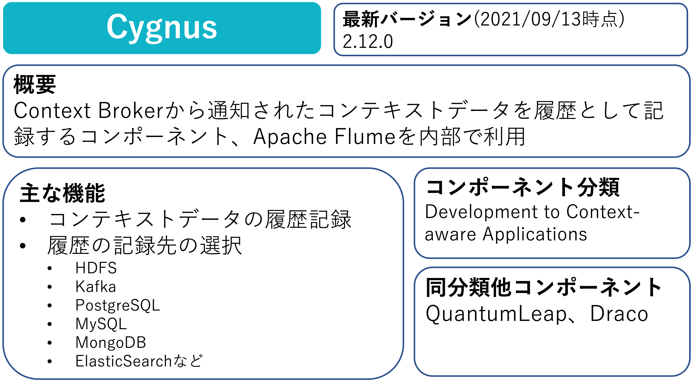
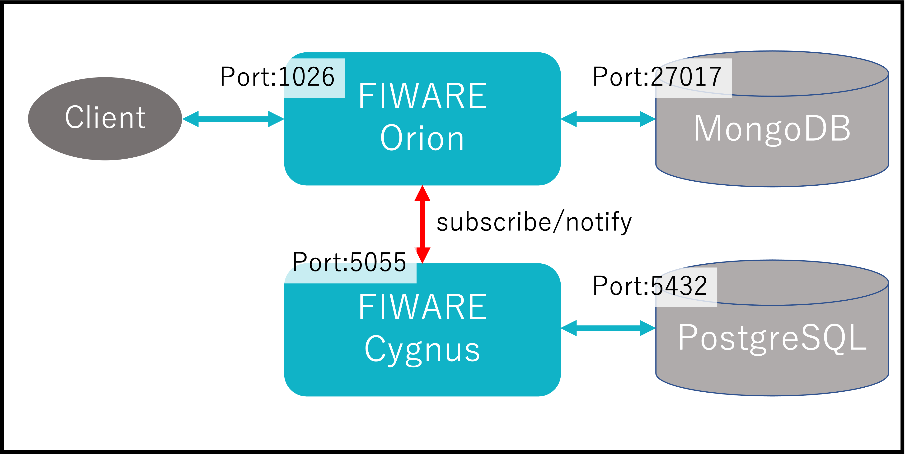

Part4ではFIWARE Cygnusによる履歴データの作成について学習していきます。

# Cygnusの概要

# 1-1 構成の起動

今回は以下の構成を起動します。

今回はdocker-composeにより以下の内容が構築されます。
※今回はFIWAREの学習がメインなので[docker-compose](https://docs.docker.jp/compose/toc.html)の説明については割愛します。

* FIWARE Orion
* MongoDB
* FIWARE Cygnus
* PostgreSQL

以下のコマンドを実行します。

`./fiware-part4/setup.sh `

以下のコマンドでdocker-composeで起動された内容を確認します。

`cat fiware-part4/assets/docker-compose.yml`

以下のコマンドで起動と初期データを確認します。

`curl localhost:1026/v2/entities | jq`

[STEP2へ](step2.md)
