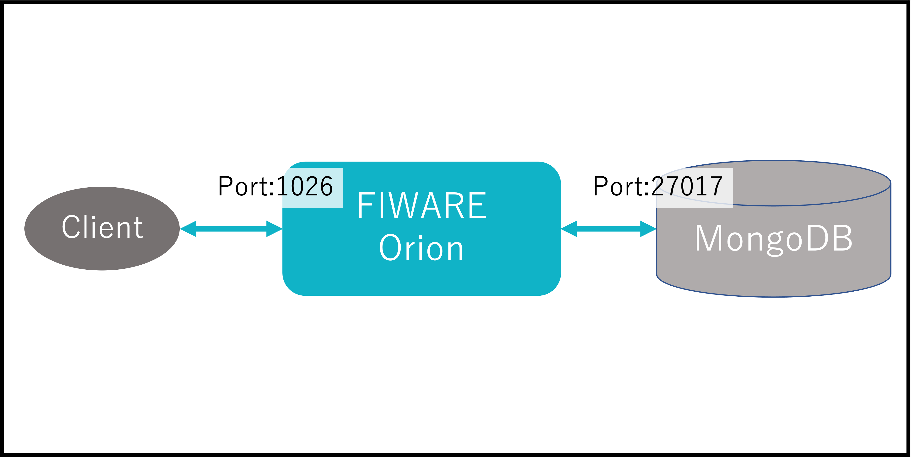
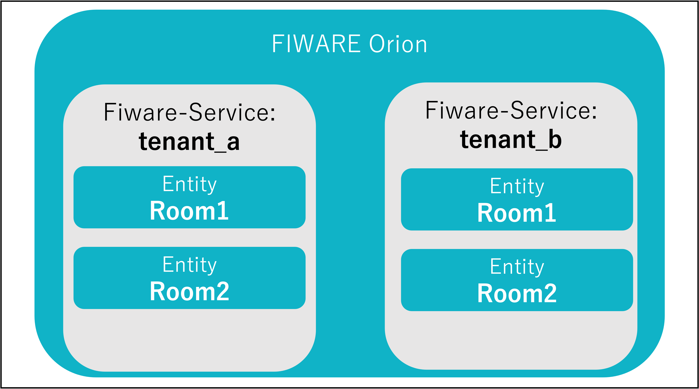

Part5ではFiware-ServiceとFiware-ServicePathについて学習します。

# 1-1 構成の起動

今回は以下の構成を起動します。

今回はdocker-composeにより以下の内容が構築されます。
※今回はFIWAREの学習がメインなので[docker-compose](https://docs.docker.jp/compose/toc.html)の説明については割愛します。

* FIWARE Orion
* MongoDB

以下のコマンドを実行します。

`./fiware-part5/setup.sh `

# 1-2 FIWARE-Serviceによるマルチテナンシーについて

FIWARE には論理的にデータベースを分離するマルチテナンシーの機能があります。  
FIWAREセキュリティフレームワーク(PEP proxy, IDM, Access Control)のようなコンポーネントで認可ポリシーの実現などを容易に実現します。

※ 図では省略してますがFiware-ServiceおよびEntityはMongoDB内で管理されています。

テナントが分かれていればRoom1とRoom2という重複したEntityIDでも登録が可能で、他のテナントからは取得などができなくなります。

# 1-3 FIWARE-Serviceを指定したEntityの登録
Orionでは"Fiware-Service"というHTTPヘッダーでテナント名を設定することができます。

今回登録するRoom1 Entityを確認します。

`cat fiware-part5/assets/example-ngsi-room1.json`

以下のコマンドで**tenant_a**にRoom1 Entityを登録します。

`curl localhost:1026/v2/entities -s -S -H 'Fiware-Service: tenant_a' -H 'Content-Type: application/json' -X POST -d @fiware-part5/assets/example-ngsi-room1.json`

以下のコマンドでEntity一覧を取得します。

`curl localhost:1026/v2/entities | jq`

デフォルトのテナントでは何も取得されません。

以下のコマンドでFiware-Serviceを指定して取得します。

`curl localhost:1026/v2/entities -H 'Fiware-Service: tenant_a' | jq`

Entityの更新や削除も同様にFiware-Serviceを指定して行うことができます。
また、Subscription APIなど他のAPIやOrion以外の他のコンポーネントもFiware-Serviceに対応しているものが多くあります。

# 1-4 Fiware-ServicePathによるスコープについて
Fiware-Serviceのマルチテナンシーとは別にFiware-ServicePathによってスコープを指定することができます。

分野を分けたり、地域を分けたりなど様々な使い方をすることができます。

スコープは以下のようにツリー構造によって表現することができます。

例： /tokyo/shinjuku/office

# 1-5 FIWARE-ServicePathを指定したEntityの登録

Orionでは"Fiware-ServicePath"というHTTPヘッダーでテナント名を設定することができます。

`curl localhost:1026/v2/entities -s -S -H 'Fiware-ServicePath: /tokyo/shinjuku/office' -H 'Content-Type: application/json' -X POST -d @fiware-part5/assets/example-ngsi-room1.json`

以下のコマンドでEntity一覧を取得します。  
デフォルトのスコープ(/)では全てのスコープが取得されます。

`curl localhost:1026/v2/entities | jq`

別のスコープを指定したコマンドを実行します。  
スコープが異なる場合はEntityが見えません。

`curl localhost:1026/v2/entities -H 'Fiware-ServicePath: /tokyo/shibuya/office' | jq`

以下のコマンドでFiware-ServicePathを指定して取得できます。

`curl localhost:1026/v2/entities -H 'Fiware-ServicePath: /tokyo/shinjuku/office' | jq`

また、Fiware-ServicePathはFiware-Serviceと併用して使うこともできます。

# 1-6 コンテナの停止・削除
起動したコンテナを停止・削除します。

1. 以下コマンドでコンテナを停止・削除します。

   `docker-compose -f fiware-part5/assets/docker-compose.yml down`

2. 完了したら以下のコマンドでコンテナが停止・削除されていることを確認します。

   `docker ps -a`

   一覧に何も表示されていなければ成功です。

[終了](finish.md)
