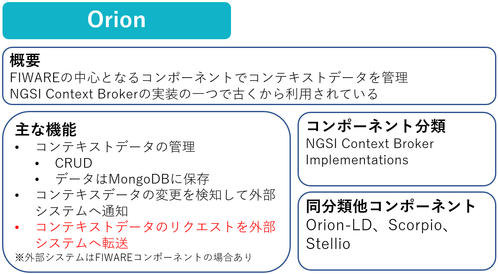
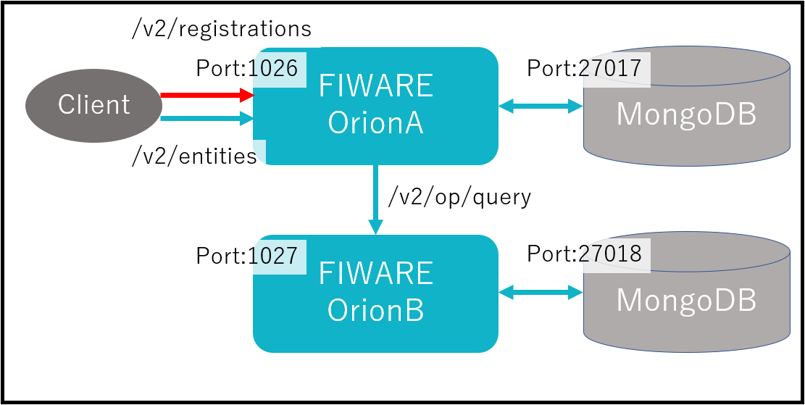
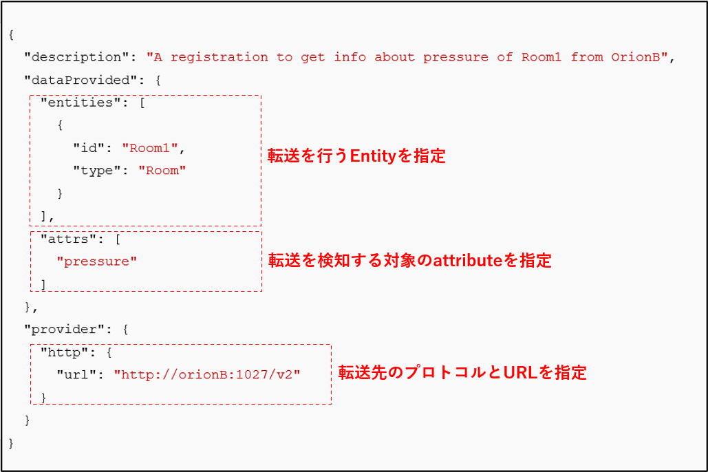

Part6ではFIWARE OrionのRegistration機能について学習していきます。

# Orionの概要



# 1-1 FIWARE OrionとMongoDBの起動確認

今回は以下の構成を起動します。



以下のコマンドを実行します。

```
docker-compose -f fiware-part6/assets/docker-compose.yml up -d
```

実行が完了したら起動していることを確認します。

```
docker ps
```

一覧にorionとmongodbがあれば成功です。

以下の手順でデータを登録します。

1. FIWARE OrionAにデータを登録します。

```
curl localhost:1026/v2/entities -s -S -H 'Content-Type: application/json' -X POST -d @fiware-part6/assets/example-ngsi-room-orionA.json
```

2. FIWARE OrionAに投入したEntityを確認します。

```
curl localhost:1026/v2/entities | jq
```

3. FIWARE OrionBにデータを登録します。

```
curl localhost:1027/v2/entities -s -S -H 'Content-Type: application/json' -X POST -d @fiware-part6/assets/example-ngsi-room-orionB.json
```

4. FIWARE OrionBに投入したEntityを確認します。

```
curl localhost:1027/v2/entities | jq
```

# 1-2 Registrationの通信の流れ

RegistrationをOrionAに設定し、Registrationの対象にしたEntityへクエリを実行した際に、OrionBへクエリが転送される流れは、以下の図の通りとなります。


**/v2/registration**  
OrionAに対して、Registrationの設定を行います。

**/v2/entities**  
OrionAに対して、クエリを実行します。

**/v2/op/query**  
OrionAからOrionBにクエリが転送されます。

# 1-3 FIWARE OrionのRegistration機能

FIWARE Orionにはクエリ/更新要求を転送する機能があります。転送の設定を行うことで、FIWARE Orionから別のシステム（別のNGSIに対応したシステム）で提供されるコンテキストデータを取得することができます。


転送が必要な大きな理由としては、以下のような点が考えられます。
- 外部サービスが保持するデータから常に最新のデータを取得することができます
- データ構造などは転送先で管理されるため、転送元のOrionが保持するデータの管理コストを軽減することができます

**/v2/registrations** へPOSTすることで転送の設定ができます。

POSTする際のbodyは以下の通りです。



この例では**OrionA**が**Room1**の**pressure**に対するクエリ/更新要求を受け付けた際に、
**OrionB**にクエリ/更新要求を転送する設定です。

# 1-4 Registrationの設定前の確認

OrionAに対して、以下のコマンドを実行し、データが取得できないことを確認します。

```
curl localhost:1026/v2/entities/Room1/attrs/pressure?type=Room -s -S -H 'Accept: application/json' | jq
```

# 1-5 Registrationの設定

以下のコマンドでOrionAに対して、Registrationの設定を行います。

```json
curl localhost:1026/v2/registrations -s -S -H 'Content-Type: application/json' -H 'Accept: application/json' -X POST -d @- <<EOF
{
  "description": "A registration to get info about pressure of Room1 from OrionB",
  "dataProvided": {
    "entities": [
      {
        "id": "Room1",
        "type": "Room"
      }
    ],
    "attrs": [
      "pressure"
    ]
  },
  "provider": {
    "http": {
      "url": "http://orionB:1027/v2"
    }
  }
}
EOF
```

# 1-6 OrionAからOrionBへの転送

Registrationの設定完了後に、OrionAに対して、以下のコマンドを再度実行します。

```
curl localhost:1026/v2/entities/Room1/attrs/pressure?type=Room -s -S -H 'Accept: application/json' | jq
```

クエリがOrionBに転送され、データが取得されることを確認します。


[STEP2へ](step2.md)
