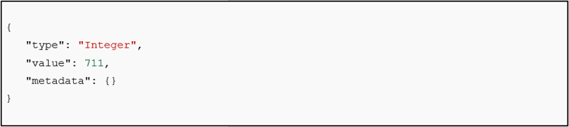

[STEP1へ](step1.md)

# 2-1 Registrationの設定前の確認

OrionAに対して、以下のコマンドを実行し、データが取得できないことを確認します。

```
curl localhost:1026/v2/entities/Room1/attrs/pressure?type=Room -s -S -H 'Accept: application/json' | jq
```

# 2-2 Registrationの設定

以下のコマンドでOrionAに対して、Registrationの設定を行います。

```json
curl localhost:1026/v2/registrations -s -S -H 'Content-Type: application/json' -H 'Accept: application/json' -X POST -d @- <<EOF
{
  "description": "A registration to get info about pressure of Room1 from OrionB",
  "dataProvided": {
    "entities": [
      {
        "id": "Room1",
        "type": "Room"
      }
    ],
    "attrs": [
      "pressure"
    ]
  },
  "provider": {
    "http": {
      "url": "http://orionB:1027/v2"
    }
  }
}
EOF
```

# 2-3 OrionAからOrionBへの転送

Registrationの設定完了後に、OrionAに対して、以下のコマンドを再度実行します。

```
curl localhost:1026/v2/entities/Room1/attrs/pressure?type=Room -s -S -H 'Accept: application/json' | jq
```

クエリがOrionBに転送され、データが取得されることを確認します。



# 2-4 Registrationの削除

Orionには`PATCH /v2/registration/<id>`は実装されていないため、Registrationを直接更新することはできません。更新する場合はRegistrationを削除して再作成する必要があります。

以下の手順で、Registrationを削除します。

1. 以下のコマンドを実行し、Registrationのidを確認します。
```
curl localhost:1026/v2/registrations | jq
```

2. 環境変数にRegistrationのidを設定します。  
以下のコマンドの = 以降に先ほど取得したRegistrationのidをコピー&ペーストして実行します。  

```
REGISTRATION_ID=取得したRegistrationのid
```

このidを使用し`/v2/registrations/{id}`のように指定することで、DELETEで削除を行うことができます。

3. 以下のコマンドを実行し、Registrationを削除します。  

```
curl localhost:1026/v2/registrations/${REGISTRATION_ID} -X DELETE
```

[STEP3へ](step3.md)
