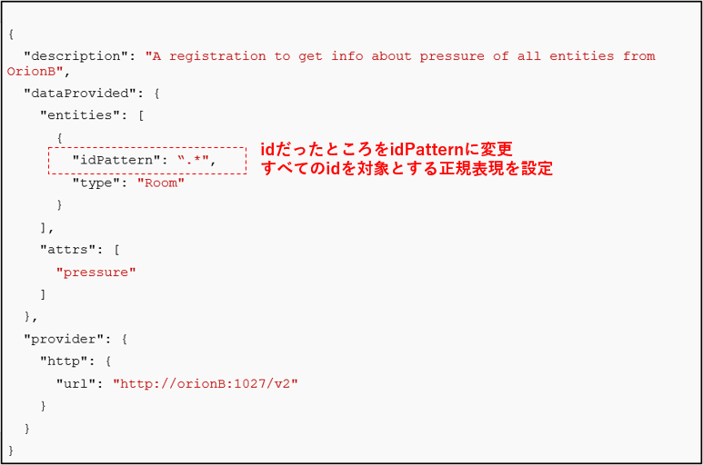

[STEP1へ](step1.md)

Orion Registrationにおける様々な設定に関して学習していきます。

# 2-1 Registrationの削除
Orionには**PATCH /v2/registration/<id>** は実装されていないため、Registrationを直接更新することはできません。更新する場合はRegistrationを削除して再作成する必要があります。

以下の手順で、Registrationを削除します。

1. 以下のコマンドを実行し、Registrationのidを確認します。
```
curl localhost:1026/v2/registrations | jq
```

2. 環境変数にRegistrationのidを設定します。  
以下のコマンドの = 以降に先ほど取得したRegistrationのidをコピー&ペーストして実行します。  

`REGISTRATION_ID=`

このidを使用し **/v2/registrations/{id}** のように指定することで、DELETEで削除を行うことができます。

3. 以下のコマンドを実行し、Registrationを削除します。  

```
curl localhost:1026/v2/registrations/${REGISTRATION_ID} -X DELETE
```

# 2-2 idPatternによる転送対象の指定
転送を行うEntityの指定方法にidPatternを使うことができます。  
idPatternは正規表現を使用しマッチしたEntityを対象とすることができます。



今回の例では".\*"を指定することで全てのidを対象にしています。

# 2-3 Registrationの設定前の確認

OrionAに対して、以下のコマンドを実行し、データが取得できないことを確認します。

```
curl localhost:1026/v2/entities/Room1/attrs/pressure?type=Room -s -S -H 'Accept: application/json' | jq
```

# 2-4 Registrationの設定

以下のコマンドでOrionAに対して、Registrationの設定を行います。

```json
curl localhost:1026/v2/registrations -s -S -H 'Content-Type: application/json' -H 'Accept: application/json' -X POST -d @- <<EOF
{
  "description": "A registration to get info about pressure of all entities from OrionB",
  "dataProvided": {
    "entities": [
      {
        "idPattern": ".*",
        "type": "Room"
      }
    ],
    "attrs": [
      "pressure"
    ]
  },
  "provider": {
    "http": {
      "url": "http://orionB:1027/v2"
    }
  }
}
EOF
```

# 2-5 OrionAからOrionBへの転送

Registrationの設定完了後に、OrionAに対して、以下のコマンドを再度実行します。

```
curl localhost:1026/v2/entities/Room1/attrs/pressure?type=Room -s -S -H 'Accept: application/json' | jq
```

クエリがOrionBに転送され、データが取得されることを確認します。


Registrationsに関する情報は公式の[Registration Operations](https://github.com/telefonicaid/fiware-orion/blob/master/doc/manuals/orion-api.md#registration-operations)に記載されています。

# 2-6 コンテナの停止・削除

起動したmongodbとorionのコンテナを停止・削除します。

1. 以下コマンドでコンテナを停止・削除します。

   `docker-compose -f fiware-part6/assets/docker-compose.yml down`

2. 完了したら以下のコマンドでコンテナが停止・削除されていることを確認します。

   `docker ps -a`

   一覧に何も表示されていなければ成功です。

[終了](finish.md)
