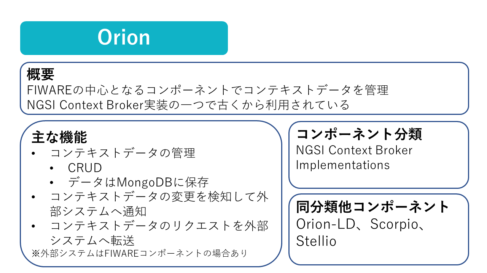
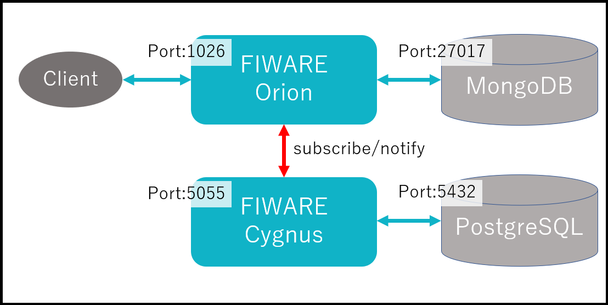
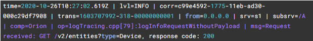

Part7ではFIWARE Orionのログ設定について学習していきます。

# Orionの概要



# 1-1 構成の起動

今回は以下の構成を起動します。



以下のコマンドを実行します。

```
docker compose -f fiware-part7/assets/docker-compose.yml up -d
```

ターミナルの処理が終了したら以下のコマンドで起動していることを確認します。

```
docker compose -f fiware-part7/assets/docker-compose.yml ps
```

一覧に**fiware-orion**, **db-mongo**, **fiware-cygnus**, **db-postgres**があれば成功です。

# 1-2 ログの出力先

デフォルトのログファイルの出力先は`/tmp/contextBroker.log`です。

ログファイルが保存されているディレクトリ(デフォルトでは`/tmp`)は、**-logDir**コマンドライン引数を使用して変更することができます。

ただし、Dockerを用いてOrion([fiware/orion](https://hub.docker.com/r/fiware/orion))を起動している場合、Dockerのベストプラクティスに従ってログは標準出力に出力され、ファイルには出力されません。

# 1-3 ログの概要解説

FIWARE Orionから出力されるログ形式は、[Splunk](http://www.splunk.com/)や[Fluentd](http://www.fluentd.org/)などのツールでの利用を想定した設計になっています。

ログファイルの各行は、パイプ文字（`|`）で区切られたいくつかのKey-Valueフィールドで構成されています。



各行のフィールドは以下の通りです。

|フィールド|説明|
|-|-|
|**time**|ログの行が生成された瞬間のタイムスタンプ（[ISO8601](https://es.wikipedia.org/wiki/ISO_8601)形式）です|
|**lvl**|FATAL、ERROR、WARN、INFO、DEBUG、SUMMARYの6つのレベルがあります。<br>SUMMARYは`-logSummary`オプションを付与した場合にのみ出力される特別なレベルになります。|
|**corr (correlator id)**|ログ1行に対して一意に割り当てられるIDです。|
|**trans (transaction id)**|トランザクションに対して一意に割り当てられるIDです。<br>以下2種類のトランザクションがあります。<br>・Orionが公開するREST APIを外部クライアントが呼び出す際に開始されるトランザクション<br>・Orionが通知(Subscription)を送信する際に開始されるトランザクション|
|**from**|トランザクションに関連付けられたHTTPリクエストのソースIPです。<br>※リクエストに`X-Forwarded-For`ヘッダー、`X-Real-IP`ヘッダーが含まれている場合、それらのヘッダーが優先されて出力されます|
|**srv**|`fiware-service`ヘッダーの値が入ります。|
|**subsrv**|`fiware-servicepath`ヘッダーの値が入ります。|
|**comp (component)**|現在のOrionのバージョンでは、このフィールドは常に「orion」が使用されます。|
|**op**|ログメッセージを生成したソースコード内の関数です。|
|**msg (message)**|実際のログメッセージです。|

[STEP2へ](step2.md)
