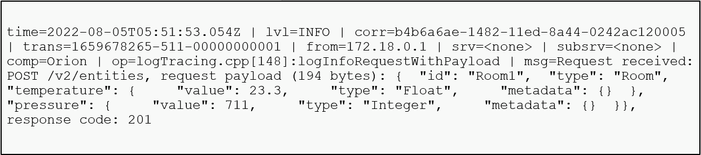
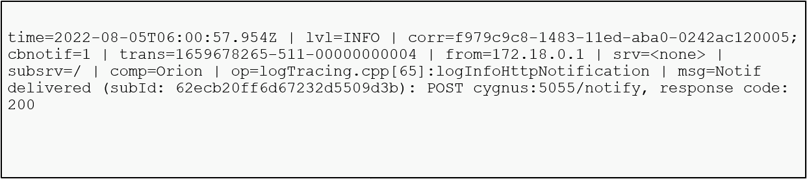

[STEP1へ](step1.md)

# 2-1 Orionが公開するREST APIを呼び出す際のログ

データ投入時のログ出力を確認します。

以下のコマンドを実行し、データを登録します。

```json
curl localhost:1026/v2/entities -s -S -H 'Content-Type: application/json' -X POST -d @- <<EOF
{
  "id": "Room1",
  "type": "Room",
  "temperature": {
     "value": 23.3,
     "type": "Float",
     "metadata": {}
  },
  "pressure": {
     "value": 711,
     "type": "Integer",
     "metadata": {}
  }
}
EOF
```

以下のコマンドを実行し、ログを確認します。

```
docker logs fiware-orion
```



`/v2/entities`へのPOSTリクエストを受信したことがログに記録されています。  
また、request payloadには受信したデータが記録されており、response codeとしてAPIの返したステータスコードが記録されています。

# 2-2 Orionが通知(Subscription)を送信する際のログ

Cygnusへの通知(Notification)時のログ出力を確認します

以下のコマンドを実行し、Subscriptionを登録します。

```json
curl -v localhost:1026/v2/subscriptions -s -S -H 'Content-Type: application/json' -X POST -d @- <<EOF
{
  "description": "A subscription to get info about Room",
  "subject": {
    "entities": [
      {
        "idPattern": ".*",
        "type": "Room"
      }
    ],
    "condition": {
      "attrs": ["temperature"]
    }
  },
  "notification": {
    "http": {
      "url": "http://cygnus:5055/notify"
    },
    "attrs": [
      "temperature"
    ]
  }
}
EOF
```

以下のコマンドを実行し、temperatureの値を変更します。

```
curl localhost:1026/v2/entities/Room1/attrs/temperature/value -s -S -H 'Content-Type: text/plain' -X PUT -d 29.5
```

以下のコマンドを実行し、ログを確認します。

```
docker logs fiware-orion
```



`cygnus:5055/notify`へのPOSTリクエストを送信したことがログに記録されています。  
また、response codeとして通知先が返したステータスコードが記録されています。

# 2-3 コマンドライン引数で設定できるログ設定

コマンドライン引数で設定できるパラメータには以下のものがあります。

|コマンドライン引数|説明|
|-|-|
|**-logDir \<dir>**|ログファイル出力先ディレクトリを指定します。|
|**-logAppend**|指定した場合、空のログファイルで開始するのではなく、既存のログファイルに追記されます。|
|**-logLevel**| ・NONE (致命的なエラーメッセージを含むすべてのログを出力しません)<br>・FATAL (致命的なエラーメッセージのみ出力します)<br>・ERROR (致命的なエラーメッセージおよびエラーメッセージを出力します)<br>・WARN (致命的なエラーメッセージ、エラーメッセージおよび警告メッセージを出力します、デフォルトの設定)<br>・INFO (致命的なエラーメッセージ、エラーメッセージ、警告メッセージおよび情報メッセージを出力します)<br>・DEBUG (すべてのメッセージを出力します)<br>  [ログレベルは管理API](https://fiware-orion.readthedocs.io/en/latest/admin/management_api.html)を使用して実行時に変更することができます。|
|**-logSummary**|ログの要約トレースを有効にできます。詳細については、[ログのドキュメント](https://fiware-orion.readthedocs.io/en/latest/admin/logs.html#summary-traces)を参照してください。|
|**-relogAlarms**|トリガー条件が発生するたびにログを出力します。詳細については、[ログのドキュメント](https://fiware-orion.readthedocs.io/en/latest/admin/logs.html#alarms)を参照してください。|
|**-logForHumans**|人間が見やすいように整形されたログを出力します。|

# 2-4 コンテナの停止・削除

起動したコンテナを停止・削除します。

1. 以下コマンドでコンテナを停止・削除します。

   `docker compose -f fiware-part7/assets/docker-compose.yml down`

2. 完了したら以下のコマンドでコンテナが停止・削除されていることを確認します。

   `docker compose -f fiware-part7/assets/docker-compose.yml ps -a`

   一覧に何も表示されていなければ成功です。

[終了](finish.md)
