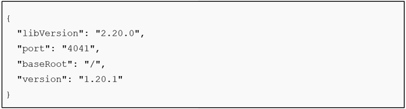
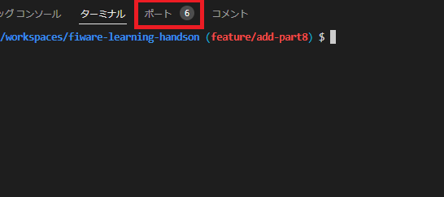
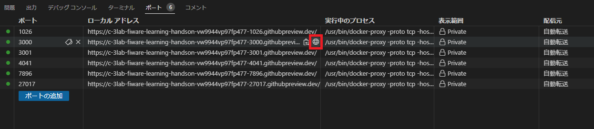
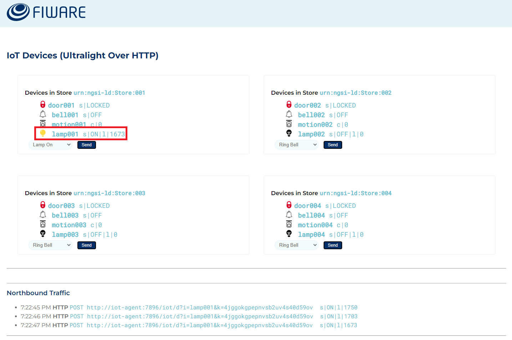
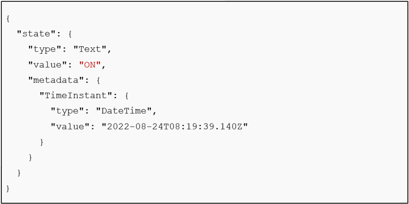

[STEP1へ](step1.md)

# 2-1 IoTAgentの設定

以下のコマンドを実行し、IoTAgentが正常に動作していることを確認します。

```
curl -X GET 'http://localhost:4041/iot/about' | jq
```



IoTAgentは、IoTDeviceとOrionとの間のミドルウェアとして機能し、IoTDeviceから送られてくる測定情報をOrionに登録します。この時、IoTAgentで`device id`から`Entity ID`への変換が行われます。

IoTDevice毎に設定されている`device id`の一意性が保証できない場合、`fiware-service` `fiware-servicepath`の2つのヘッダーを使用することで、IoTDeviceを識別するための条件を追加することができます。`fiware-service`にテナント名、部門などを、`fiware-servicepath`に分野、地域などを設定します。

`fiware-service` `fiware-servicepath`の詳細に関しては[Part5](../fiware-part5/step1.md)を参照してください。

`device id`の一意性が保証できない例としては、異なるメーカーのIoTDeviceを併用する場合などが挙げられます。

メーカーがFIWAREとの通信を想定した一意の`device id`を設定するとした場合、
メーカー単位では一意性が保証されるが、異なるメーカーのIoTDeviceを併用する場合は一意性が保証されません。

以下のコマンドを実行し、IoTDeviceからのデータをIoTAgentが受け付ける設定をします。

```
curl -iX POST \
  'http://localhost:4041/iot/services' \
  -H 'Content-Type: application/json' \
  -H 'fiware-service: openiot' \
  -H 'fiware-servicepath: /' \
  -d '{
 "services": [
   {
     "apikey":      "4jggokgpepnvsb2uv4s40d59ov",
     "cbroker":     "http://orion:1026",
     "entity_type": "Thing",
     "resource":    "/iot/d"
   }
 ]
}'
```

# 2-2 仮想IoTDeviceの説明

本Partでは以下の仮想IoTDeviceを使用します。

|デバイス名|機能説明|
|-|-|
|スマートドア|リモートでロックまたはロック解除するコマンドを送信できる電子ドアです。|
|ベル|コマンドに応答して、ベルを鳴らします。|
|モーションセンサー|コマンドには反応しませんが、スマートドアを通過する顧客の数を測定します。ドアのロックが解除されている場合、モーションセンサーは動きを検出し、測定値をIoTAgentに送ります。|
|スマートランプ|リモートでオンとオフを切り替えることができ、光度も記録します。内部にモーション センサー(※)が含まれており、動きが検出されないまま時間が経過するとゆっくりと暗くなります。|

※動きを検出し光度レベルを変化させるためのセンサー、同表のスマートドアのモーションセンサーとは別物

以下のコマンドを実行し、IoTAgent経由でMongoDBに上記デバイスのデータを登録します。

```
./fiware-part8/setup.sh
```

### 仮想IoTDeviceのGUIでの操作方法

以下の手順で仮想IoTDeviceの操作画面にアクセスします。

1. **ポートタブ**をクリックします。



2. **ポート3000**の行にカーソルを合わせると表示される、赤枠のアイコンをクリックします。



3. 画面の**Device Monitor**をクリックします。


4. 仮想IoTDeviceの操作画面が開かれます。


画面を開くと、店舗毎にデバイスが表示されています。各店舗のプルダウンからデバイスに対する操作を選択し、**Sendボタン**をクリックします。

※仮想IoTDevice004はIoTAgentにデバイスの登録を行っていないため、現時点では動作しません

# 2-3 仮想IoTDeviceを使用してのデータ更新

仮想IoTDevice001～003を使用して、データの更新を行います。

今回は、スマートランプ（lamp001)を例に操作を行っていきます。

インターネットを利用して、店舗の照明を外部から点けてみましょう。画面に表示されている店舗の内、`urn:ngsi-ld:Store:001`を確認します。左下のプルダウンから`Lamp On`を選択し、**Sendボタン**をクリックします。


### データ更新結果の確認

`lamp001`が`On`になっていることを確認します。



IoTDeviceが測定したデータが、IoTAgentを介してOrionに反映されていることを確認します。
以下のコマンドを実行し、Orionから`lamp001`のデータを取得します。

```
curl -X GET 'http://localhost:1026/v2/entities/urn:ngsi-ld:Lamp:001/attrs?attrs=state&type=Lamp' -H 'fiware-service: openiot' -H 'fiware-servicepath: /' | jq
```



取得したデータを確認すると、`state`の`value`が`ON`に更新されていることがわかります。

[STEP3へ](step3.md)
