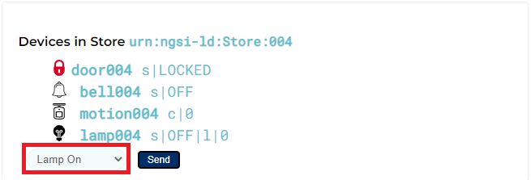
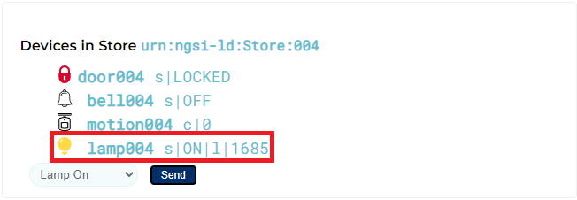
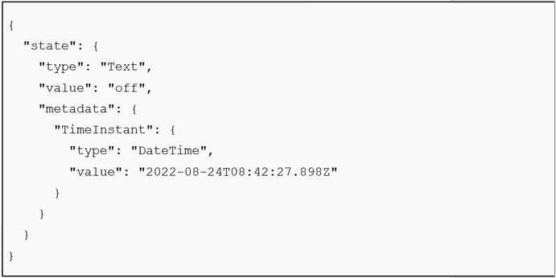

[STEP2へ](step2.md)

# 3-1 IoTAgentに仮想IoTDeviceを登録

IoTAgentにデバイス登録していないと、デバイスからのデータ送信をIoTAgentは受け付けません。そのため、現時点ではデバイス登録していない仮想IoTDevice004は画面上で操作をしても変化しません。

仮想IoTDevice004を使用できるようにするため、以下のコマンドを実行し、IoTAgentにデバイスを登録します。  
※画面上でデバイスの操作を行っている場合、`door004` `bell004` `motion004` `lamp004`が未知のデバイスとして自動的に登録されてしまいます。そのため、以下のコマンドではデバイスの削除をしてから登録を行います。

 1. スマートドアの削除
 ```
 curl -iX DELETE 'http://localhost:4041/iot/devices/door004' -H 'fiware-service:  openiot' -H 'fiware-servicepath: /'
 ```

2. スマートドアの登録
```
curl -iX POST \
  'http://localhost:4041/iot/devices' \
  -H 'Content-Type: application/json' \
  -H 'fiware-service: openiot' \
  -H 'fiware-servicepath: /' \
  -d '{
  "devices": [
    {
      "device_id": "door004",
      "entity_name": "urn:ngsi-ld:Door:004",
      "entity_type": "Door",
      "protocol": "PDI-IoTA-UltraLight",
      "transport": "HTTP",
      "endpoint": "http://dummy-device:3001/iot/door004",
      "commands": [
        {"name": "unlock","type": "command"},
        {"name": "open","type": "command"},
        {"name": "close","type": "command"},
        {"name": "lock","type": "command"}
       ],
       "attributes": [
        {"object_id": "s", "name": "state", "type":"Text"}
       ]
    }
  ]
}'
```

3. ベルの削除
```
curl -iX DELETE 'http://localhost:4041/iot/devices/bell004' -H  'fiware-service:   openiot' -H 'fiware-servicepath: /'
```

4. ベルの登録
```
curl -iX POST \
  'http://localhost:4041/iot/devices' \
  -H 'Content-Type: application/json' \
  -H 'fiware-service: openiot' \
  -H 'fiware-servicepath: /' \
  -d '{
  "devices": [
    {
      "device_id": "bell004",
      "entity_name": "urn:ngsi-ld:Bell:004",
      "entity_type": "Bell",
      "protocol": "PDI-IoTA-UltraLight",
      "transport": "HTTP",
      "endpoint": "http://dummy-device:3001/iot/bell004",
      "commands": [
        { "name": "ring", "type": "command" }
       ]
    }
  ]
}'
```

5. モーションセンサーの削除
```
curl -iX DELETE 'http://localhost:4041/iot/devices/motion004' -H 'fiware-service:   openiot' -H 'fiware-servicepath: /'
```

6. モーションセンサーの登録
```
curl -iX POST \
  'http://localhost:4041/iot/devices' \
  -H 'Content-Type: application/json' \
  -H 'fiware-service: openiot' \
  -H 'fiware-servicepath: /' \
  -d '{
 "devices": [
   {
     "device_id":   "motion004",
     "entity_name": "urn:ngsi-ld:Motion:004",
     "entity_type": "Motion",
     "timezone":    "Europe/Berlin",
     "attributes": [
       { "object_id": "c", "name": "count", "type": "Integer" }
     ]
   }
 ]
}'
```

7. スマートランプの削除
```
curl -iX DELETE 'http://localhost:4041/iot/devices/lamp004' -H 'fiware-service:   openiot' -H 'fiware-servicepath: /'
```

8. スマートランプの登録
```
curl -iX POST \
  'http://localhost:4041/iot/devices' \
  -H 'Content-Type: application/json' \
  -H 'fiware-service: openiot' \
  -H 'fiware-servicepath: /' \
  -d '{
  "devices": [
    {
      "device_id": "lamp004",
      "entity_name": "urn:ngsi-ld:Lamp:004",
      "entity_type": "Lamp",
      "protocol": "PDI-IoTA-UltraLight",
      "transport": "HTTP",
      "endpoint": "http://dummy-device:3001/iot/lamp004",
      "commands": [
        {"name": "on","type": "command"},
        {"name": "off","type": "command"}
       ],
       "attributes": [
        {"object_id": "s", "name": "state", "type":"Text"},
        {"object_id": "l", "name": "luminosity", "type":"Integer"}
       ]
    }
  ]
}'
```

各POSTリクエストの主な項目の説明は以下の通りです。

|項目名|説明|
|-|-|
|device_id|デバイスを識別するためのidを設定します。|
|entity_name|Orionに登録されるときの`Entity ID`を設定します。<br>各デバイスからULプロトコルで送られてきた`i`(`device_id`)から`entity_name`(`Entity id`)にマッピングされます。|
|entity_type|Orionに登録されるときの`Entity Type`を設定します。|
|endpoint|デバイスがコマンドを受け付けるendpointを設定します。|
|commands|デバイスに対して行える操作を設定します。|
|attributes|Orionに登録されるときの`Entity Attribute`を設定します。<br>各デバイスからULプロトコルで送られてきた`s`, `l`(`object_id`)などから`state`, `luminosity`(`name`)などにマッピングされます。|

# 3-2 仮想IoTDevice004の動作確認

3-1でIoTAgentに登録した仮想IoTDevice004が正常に動作することを確認します。

画面に表示されている店舗の内、`urn:ngsi-ld:Store:004`を確認します。左下のプルダウンから`Lamp On`を選択し、**Sendボタン**をクリックします。



`lamp004`が`On`になっていることを確認します。



# 3-3 デバイスからの通信内容

3-2で画面から操作した際にはデバイスからIoTAgentにリクエストが送られていました。この項では、手動でIoTAgentにリクエストを送ることで、デバイスからの通信内容を確認します。

以下の手順で、IoTAgentに直接コマンドを実行することで、仮想IoTDevice004からIoTAgentに送られている通信内容を確認します。

1. 以下のコマンドを実行し、IoTAgentに直接データを送信します。

```
curl -iX POST \
  'http://localhost:7896/iot/d?k=4jggokgpepnvsb2uv4s40d59ov&i=lamp004' \
  -H 'Content-Type: text/plain' \
  -d 's|off'
```

2. 以下のコマンドを実行し、Orionからデータを取得します。

```
curl -X GET 'http://localhost:1026/v2/entities/urn:ngsi-ld:Lamp:004/attrs?attrs=state&type=Lamp' -H 'fiware-service: openiot' -H 'fiware-servicepath: /' | jq
```



3-1で行ったデバイス登録により、実行コマンドの`s`が`state`にマッピングされています。今回は`Ultralight2.0`を使用しており、`state`が`s`になることにより、デバイスとIoTAgentとの間のデータ通信量を少なくできます。

※IoTAgentに対して定期的に仮想IoTDeviceの現在の状態が送信されるため、コマンド実行直後は`state`の`value`が`OFF`になっていますが、一定時間経過後は`ON`に更新されます

# 3-4 コンテナの停止・削除

起動したコンテナを停止・削除します。

1. 以下コマンドでコンテナを停止・削除します。

   `docker compose -f fiware-part8/assets/docker-compose.yml down`

2. 完了したら以下のコマンドでコンテナが停止・削除されていることを確認します。

   `docker compose -f fiware-part8/assets/docker-compose.yml ps -a`

   一覧に何も表示されていなければ成功です。

[終了](finish.md)
