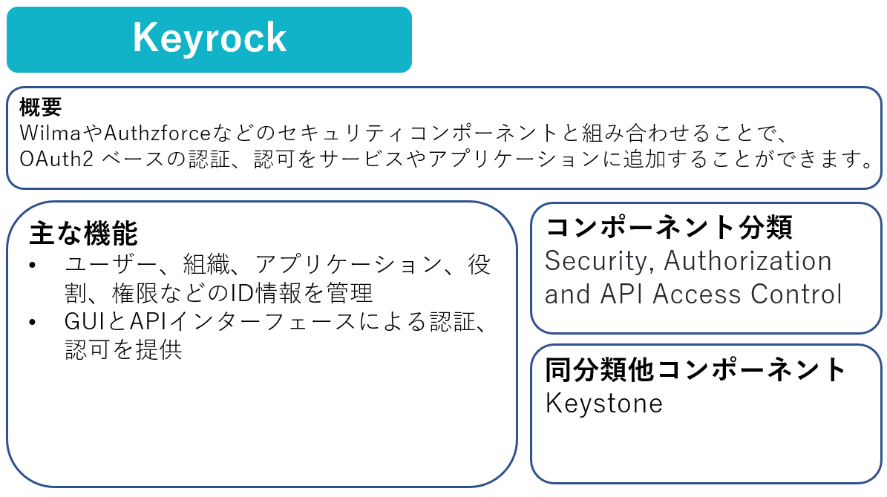
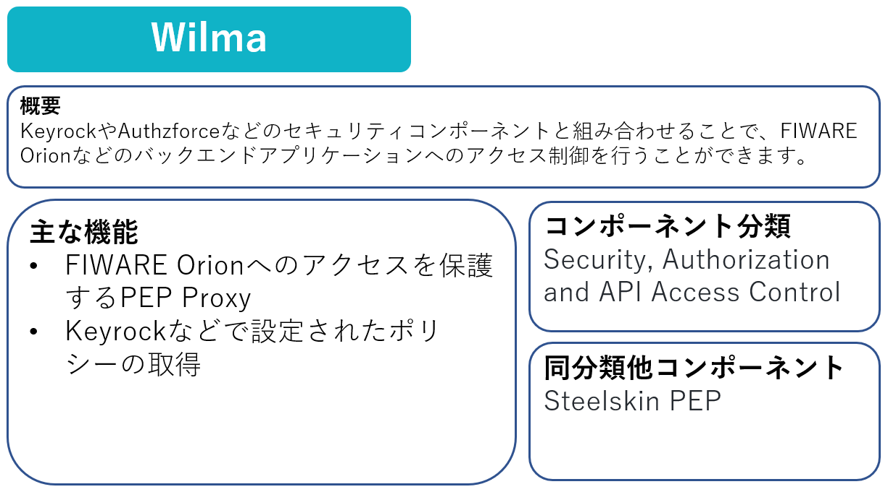
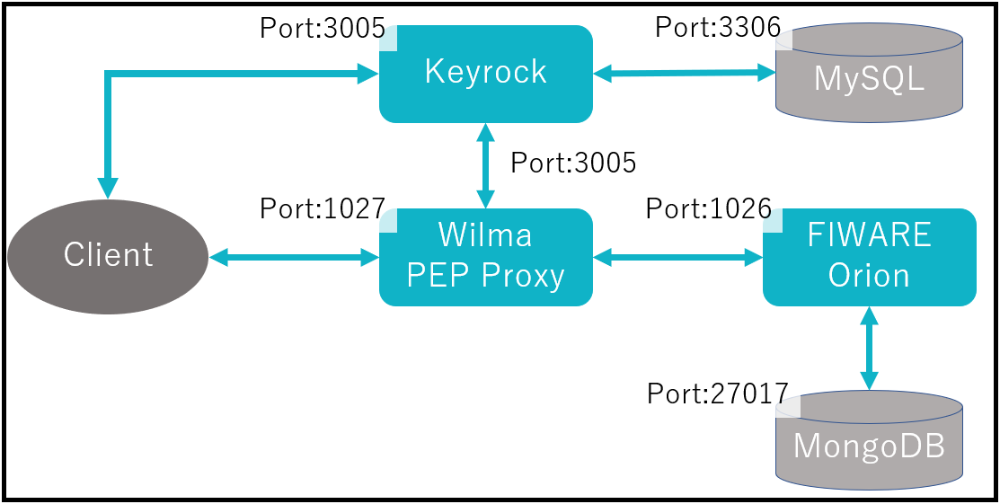

Part9ではFIWAREコンポーネントのアクセス保護について学習していきます。

# 1-1 FIWAREコンポーネントのアクセス保護の必要性

適切なFIWAREコンポーネントのアクセス保護が行われていない場合、アクセス権限を持たない第三者が悪意を持ってサーバーやシステムに侵入する行為である不正アクセスが行われ、情報の漏洩や改ざんなどの被害が出る可能性があります。

これらを防ぐため、KeyrockやWilmaなどのコンポーネントを使用して、バックエンド・アプリケーションに認証および認可のセキュリティを追加し、許可されたユーザのみがOrionやRESTサービスにアクセスできるようにします。

# 1-2 KeyrockとWilmaの概要





# 1-3 構成の起動

今回は以下の構成を起動します。



以下のコマンドを実行します。

```
docker compose -f fiware-part9/assets/docker-compose.yml up -d
```

ターミナルの処理が終了したら以下のコマンドで起動していることを確認します。

```
docker compose -f fiware-part9/assets/docker-compose.yml ps
```

一覧に**fiware-orion-proxy**, **fiware-orion**, **fiware-keyrock**, **db-mongo**, **db-mysql**があれば成功です。

# 1-4 KeyrockとWilmaの設定

手順の簡略化のため、本PartではKeyrockのGUIやAPIインターフェースを利用したユーザー、アプリケーションの登録の手順は省略しています。

docker-compose.ymlによるコンテナ起動時に、以下のデータが自動的に登録されます。

管理者ユーザー
|名前|Eメール|パスワード|
|-|-|-|
|alice|`alice-the-admin@test.com`|test|

アプリケーション
|Key|Value|
|-|-|
|Client ID|tutorial-dckr-site-0000-xpresswebapp|
|Client Secret|tutorial-dckr-site-0000-clientsecret|

[STEP2へ](step2.md)
