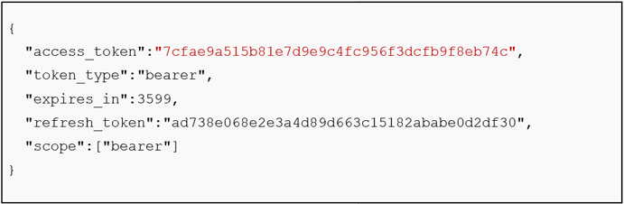

[STEP1へ](step1.md)

# 2-1 アクセスの確認

以下のコマンドを実行し、Authorizationヘッダに指定するトークンを作成します。

※作成するトークンは`ClientID:Client Secret`をBase64エンコードした値になります

```
echo -n "tutorial-dckr-site-0000-xpresswebapp:tutorial-dckr-site-0000-clientsecret" | openssl base64 -A
```

次の手順で作成したトークンを使用するため、環境変数に作成したトークンを設定しておきます。
以下のコマンドの = 以降に先ほど作成したトークンをコピー&ペーストして実行します。

```
TOKEN=echoで表示した値
```

以下のコマンドを実行し、Keyrockからアクセストークンを取得します。

```
curl -iX POST \
  "http://localhost:3005/oauth2/token" \
  -H "Accept: application/json" \
  -H "Authorization: Basic ${TOKEN}" \
  -H "Content-Type: application/x-www-form-urlencoded" \
  --data "username=alice-the-admin@test.com&password=test&grant_type=password"
```



次の手順でaccess_tokenを使用するため、環境変数にaccess_tokenを設定しておきます。  
以下のコマンドの = 以降に先ほど取得したaccess_tokenをコピー&ペーストして実行します。  

```
ACCESS_TOKEN=レスポンスに含まれるアクセストークン
```

以下の手順で、アクセストークンを使用したOrionへのアクセスを確認します。

1. 以下のコマンドを実行し、正しいアクセストークンを指定した場合、Orionからデータを取得できることを確認します。

  ```
  curl -X GET \
    http://localhost:1027/v2/entities \
    -H "X-Auth-Token: ${ACCESS_TOKEN}"
  ```

  空のjson配列`[]`が返ってくれば成功です。

2. 以下のコマンドを実行し、間違ったアクセストークンを指定した場合、Orionからデータが取得されないことを確認します。

```
curl -X GET \
  http://localhost:1027/v2/entities \
  -H "X-Auth-Token: bad_token"
```
`Invalid token: access token is invalid`が出力されることを確認します。

# 2-2 コンテナの停止・削除
起動したコンテナを停止・削除します。

1. 以下コマンドでコンテナを停止・削除します。

   `docker compose -f fiware-part9/assets/docker-compose.yml down`

2. 完了したら以下のコマンドでコンテナが停止・削除されていることを確認します。

   `docker compose -f fiware-part9/assets/docker-compose.yml ps -a`

一覧に何も表示されていなければ成功です。

[終了](./finish.md)
