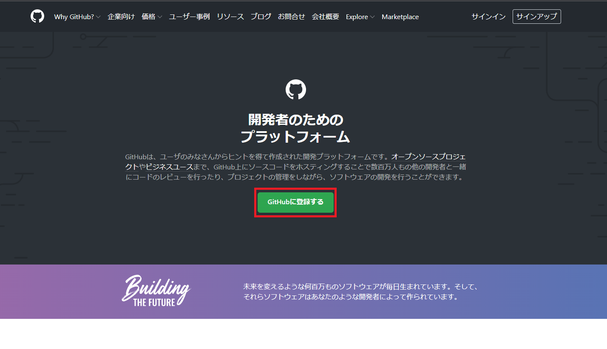
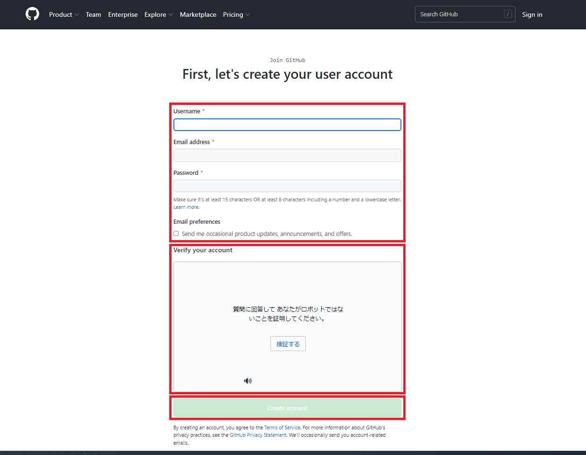
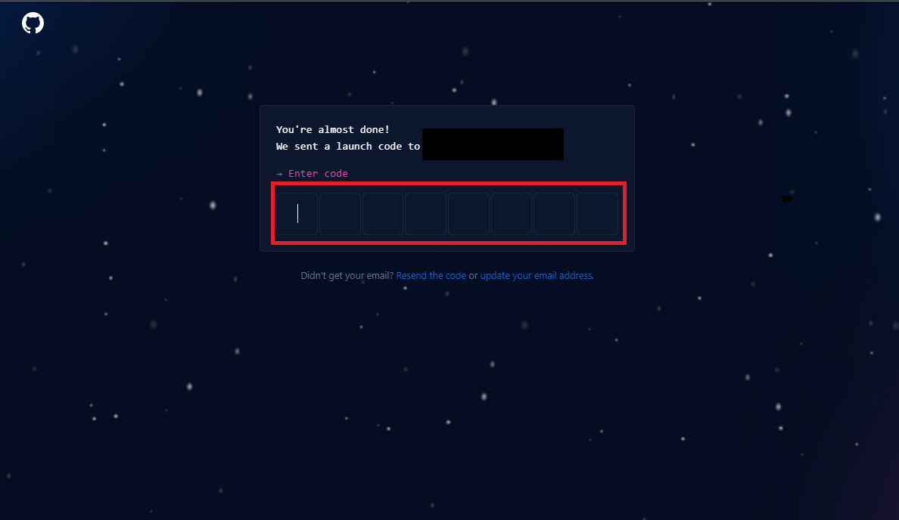
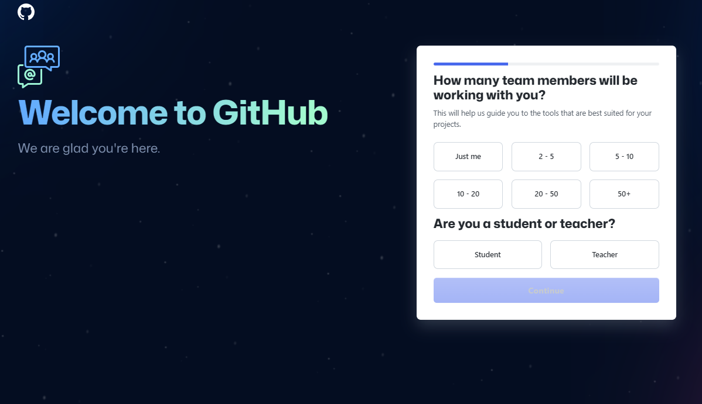
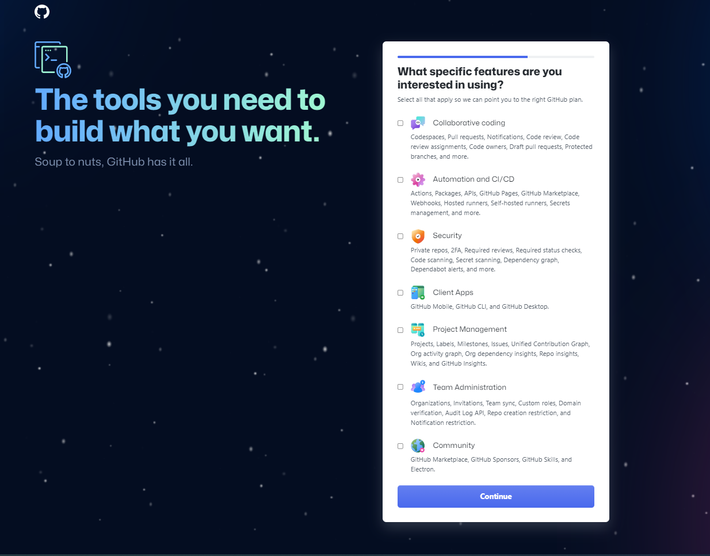
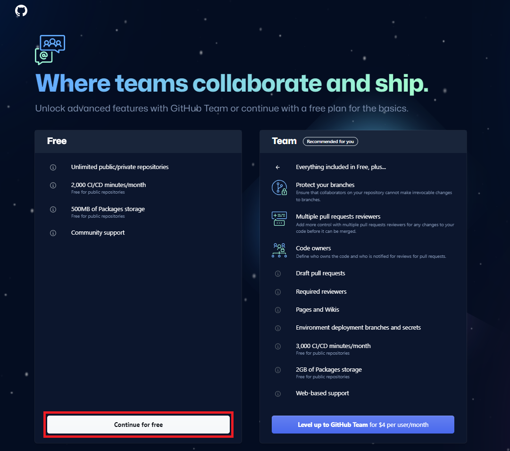
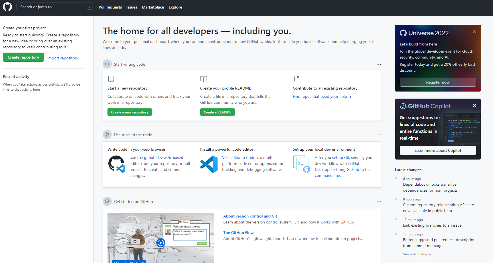
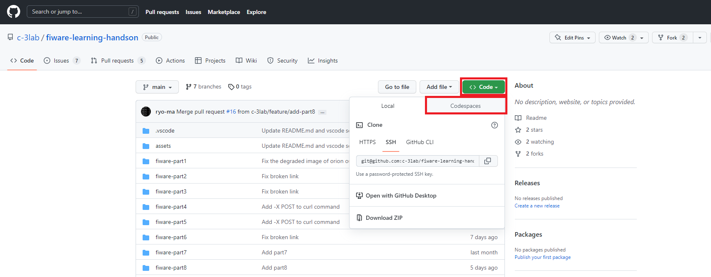
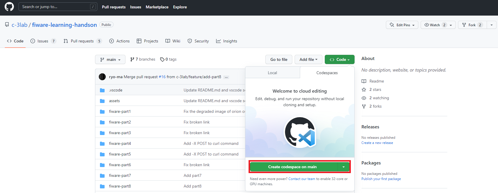
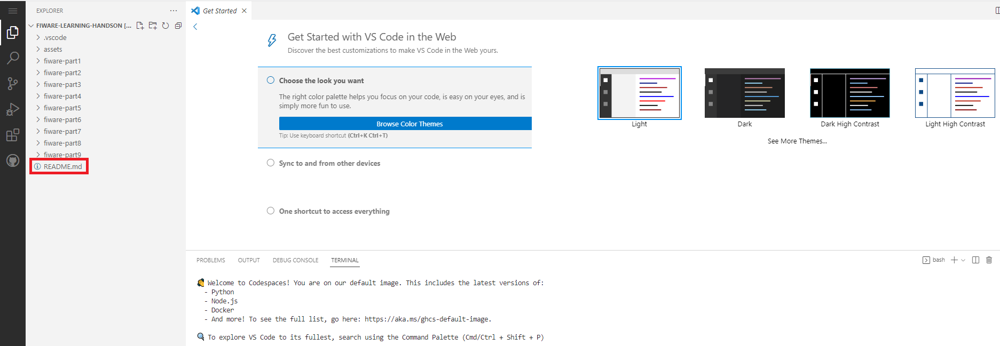

# GitHubアカウントの作成手順

[GitHubアカウントをすでに持っている人はこちら](#github-codespacesの利用手順)

1. [GitHub](https://github.co.jp/) にアクセスします。

2. 画面中央の**GitHubに登録する**をクリックします。



3. 登録画面で、**Username**、**Email address**、**Password**を入力し、**Verify your account**の指示に従ってアカウント認証を行います。入力・認証完了後に画面下部の**Create accountボタン**をクリックします。



4. 登録したメールアドレス宛にGitHubから確認メールが送られてきます。メールに記載されている8桁のコードを入力します。



5. 画面の質問に回答していきます。





6. **Continue for free**をクリックします。



7. GitHubのポータル画面が表示されます。



# GitHub Codespacesの利用手順

GitHub Codespacesを利用して学習を行うためには、以下の[有料プラン](https://github.co.jp/pricing)に加入する必要があります。
- GitHub Team
- GitHub Enterprise

既にGitHub Codespacesのベータ版を利用しているユーザーについては、Freeプランのまま学習を行うことができます。

以下の手順でGitHub Codespacesを起動します。

1. 画面の**Codeボタン**をクリックし、表示されたメニューの**Codespaces**タブをクリックします。



2. **Create codespace on main**をクリックし、GitHub Codespacesを起動します。



3. GitHub Codespacesを起動後、README.mdをクリックして学習を開始してください。



# GitHub Codespacesを利用しない場合

GitHub Codespacesを利用しない場合は、以下条件を満たすことで無償で学習を行うことができます。
1. docker、docker compose、curl、git などが使える環境を用意する
2. 上記の環境に本リポジトリをクローンする

# GitHub Codespacesタイムアウト時の対応手順

GitHub Codespacesを利用して学習を行う場合、操作せずに一定時間が経過するとタイムアウトとなり、環境から自動で切断されます。

タイムアウトの際は、以下の手順を行ってください。

1. 以下のコマンドを実行し、コンテナを再起動します。  
    **Part1の場合**
    ```
    docker start mongodb

    docker rm orion
    docker run -d --name orion --link mongodb:mongodb -p 1026:1026 fiware/orion -dbhost mongodb
    ```

    **Part2～Part10の場合**
    ```
    docker compose -f fiware-part2/assets/docker-compose.yml up -d
    ```
    ※-fオプションで指定している`docker-compose.yml`のパスは、学習中のPartに合わせて変更してください

2. 以下のコマンドを実行し、コンテナが起動していることを確認します。  
    **Part1の場合**
    ```
    docker ps
    ```

    **Part2～Part10の場合**
    ```
    docker compose -f fiware-part2/assets/docker-compose.yml ps
    ```
    ※-fオプションで指定している`docker-compose.yml`のパスは、学習中のPartに合わせて変更してください

# コンテナが停止した際の対応手順

GitHub Codespacesを実行している仮想マシンのリソースによっては、学習中にコンテナが落ちる場合があります。

その際は、[GitHub Codespacesタイムアウト時の対応手順](#github-codespacesタイムアウト時の対応手順)に従い、コンテナを再起動してください。
